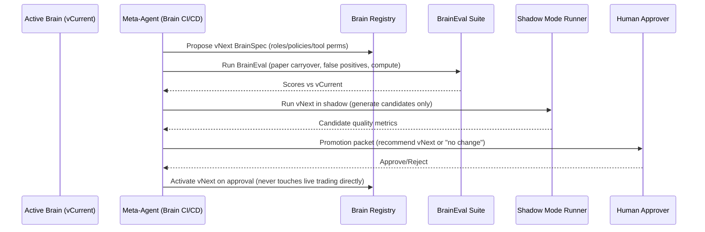

# ChiseAI Architecture Document

**Version:** 1.0.0  
**Status:** Active  
**Last Updated:** 2026-02-09  
**Author:** Chise Autonomous Development System  

---

## Table of Contents

1. [Executive Summary](#1-executive-summary)
2. [System Context and Boundaries](#2-system-context-and-boundaries)
3. [Core Components and Data Flows](#3-core-components-and-data-flows)
4. [Neuro-Symbolic Architecture](#4-neuro-symbolic-architecture)
5. [Strategy CI/CD Pipeline](#5-strategy-cicd-pipeline)
6. [Brain CI/CD Pipeline](#6-brain-cicd-pipeline)
7. [Risk Management and Guardrails](#7-risk-management-and-guardrails)
8. [Execution Modes](#8-execution-modes)
9. [Data Architecture](#9-data-architecture)
10. [Observability and Monitoring](#10-observability-and-monitoring)
11. [Implementation Phases](#11-implementation-phases)
12. [Appendices](#12-appendices)

---

## 1. Executive Summary

ChiseAI is a sophisticated crypto trading analysis system that transforms emotional, time-intensive trading into data-driven, profitable market insights. The system leverages a **neuro-symbolic architecture** combining neural/LLM components with symbolic constraints to enable autonomous strategy evolution while maintaining rigorous safety controls.

### Key Architectural Principles

1. **Staged Promotion:** All changes flow through Backtest → Paper (canary → full) → Human Approval → Live
2. **Neuro-Symbolic Governance:** Learned/LLM reasoning proposes; symbolic constraints enforce caps, invariants, and promotion rules
3. **Constrained Action Space:** AI can only modify strategies via approved DSL/config interfaces, never "free-edit" live behavior
4. **Auditability:** Every change is versioned, reproducible, diffable, and tied to evidence
5. **Champion/Challenger:** Always compare challengers against a champion; keep rollback ready

### System Objectives (Lexicographic Priority)

1. **Primary:** Maximize net profit (after fees + modeled slippage)
2. **Secondary:** Minimize turnover (trades/day)
3. **Tertiary:** Minimize drawdown (within hard risk caps)

---

## 2. System Context and Boundaries

### 2.1 System Context Diagram

```mermaid
flowchart LR
  subgraph Human[Human / Operator]
    A1[Approves Live Promotions]
    A2[Reviews Promotion Packets]
  end

  subgraph Exchanges[Exchanges / Brokers]
    X1[Binance - Reference Market Data]
    X2[Bybit - Paper Trading]
    X3[Bitget - Live Trading]
  end

  subgraph System[ChiseAI System Boundary]
    D1[(Market Data Store)]
    D2[(Feature Store)]
    D3[(Audit Log / Event Store)]
    R1[Backtest Engine]
    P1[Paper Trading Layer]
    L1[Live Trading Layer]
    G1[Guardrails Engine<br/>(risk caps + invariants)]
    O1[LLM R&D Orchestrator]
    S1[Strategy Registry]
    B1[Brain Registry]
    M1[Monitoring + Drift Detection]
  end

  Human -->|Approval| L1
  Human -->|Reads| PP[Promotion Packet]

  Exchanges --> D1
  Exchanges --> P1
  Exchanges --> L1

  D1 --> D2
  D1 --> D3
  P1 --> D3
  L1 --> D3

  O1 --> R1
  O1 --> P1
  O1 --> PP
  O1 --> S1
  O1 --> B1

  G1 --> P1
  G1 --> L1
  G1 --> R1

  M1 --> O1
  M1 --> PP
  M1 --> G1
```

### 2.2 External Actors

| Actor | Role | Interaction |
|-------|------|-------------|
| **Human Operator** | Approves live promotions, reviews packets | Reads promotion packets, approves live deployment |
| **Binance** | Reference market structure data | Order book, liquidity, open interest (OI) |
| **Bybit** | Paper trading execution | Demo environment for strategy validation |
| **Bitget** | Live trading execution | Real execution with strict risk controls |
| **Discord** | Alert delivery | Real-time notifications for signals and events |

### 2.3 System Boundaries

- **In Scope:** Market analysis, signal generation, risk management, paper/live execution, strategy evolution, brain upgrades
- **Out of Scope:** Custody (non-custodial), regulatory compliance automation, spot execution (perps-first)

---

## 3. Core Components and Data Flows

### 3.1 Logical Component Architecture

```mermaid
flowchart TB
  subgraph Layer0[Truth & Storage]
    E[(Event Store / Audit Log)]
    MD[(Market Data Store)]
    FS[(Feature Store)]
  end

  subgraph Layer1[Execution & Risk]
    OMS[Execution Engine (OMS/EMS)]
    RISK[Symbolic Guardrails Engine]
    BUDGET[Trade Budgeter (20 tokens/day)]
  end

  subgraph Layer2[Strategy Runtime]
    STRAT[Strategy Engine (DSL compiled)]
    REG[Regime / Predictive Models]
  end

  subgraph Layer3[Evaluation & Experimentation]
    BT[Backtest + Walk-forward Harness]
    STRESS[Stress + Sensitivity Sweeps]
    SELECT[Selection Policy (profit, then turnover)]
  end

  subgraph Layer4[Autonomous R&D (The "Brain")]
    ORCH[LLM Orchestrator (planner/critic/evaluator)]
    MUT[Mutation Operators (params + structure)]
    PACK[Promotion Packet Generator]
  end

  subgraph Layer5[Promotion & Release]
    SREG[(Strategy Registry)]
    BREG[(Brain Registry)]
    PAPER[Paper Canary → Paper Full]
    LIVE[Live (Human Approved)]
  end

  MD --> FS
  MD --> E
  OMS --> E
  STRAT --> OMS
  REG --> STRAT
  RISK --> OMS
  BUDGET --> STRAT

  ORCH --> MUT --> BT
  BT --> STRESS --> SELECT
  SELECT --> SREG
  ORCH --> PAPER
  PAPER --> E
  ORCH --> PACK
  PACK --> LIVE
  BREG --> ORCH
```

### 3.2 Component Descriptions

#### Layer 0: Truth & Storage

| Component | Technology | Purpose |
|-----------|------------|---------|
| **Market Data Store** | InfluxDB | Time-series OHLCV, order book, OI data |
| **Feature Store** | PostgreSQL + Redis | Computed features, technical indicators |
| **Event Store / Audit Log** | PostgreSQL (append-only) | Immutable record of all signals, trades, decisions |

#### Layer 1: Execution & Risk

| Component | Responsibility |
|-----------|----------------|
| **Execution Engine (OMS/EMS)** | Order management, position tracking, fill processing |
| **Symbolic Guardrails Engine** | Enforces risk caps, invariants, kill-switches |
| **Trade Budgeter** | Enforces 20 trades/day ceiling, token-based spending |

#### Layer 2: Strategy Runtime

| Component | Responsibility |
|-----------|----------------|
| **Strategy Engine** | Executes compiled DSL strategies, generates signals |
| **Regime/Predictive Models** | Market regime classification, trend prediction |

#### Layer 3: Evaluation & Experimentation

| Component | Responsibility |
|-----------|----------------|
| **Backtest Harness** | Walk-forward validation, historical simulation |
| **Stress + Sensitivity** | Fee/slippage sweeps, volatility stress tests |
| **Selection Policy** | Lexicographic ranking: profit → turnover/complexity |

#### Layer 4: Autonomous R&D (The "Brain")

| Component | Responsibility |
|-----------|----------------|
| **LLM Orchestrator** | Plans experiments, critiques candidates, evaluates results |
| **Mutation Operators** | Parameter and structural strategy mutations |
| **Promotion Packet Generator** | Creates human-readable approval packets |

#### Layer 5: Promotion & Release

| Component | Responsibility |
|-----------|----------------|
| **Strategy Registry** | Versioning, champion/challenger tracking, artifacts |
| **Brain Registry** | Brain version management, BrainEval results |
| **Paper Deployment** | Auto-deploy to paper (canary → full) |
| **Live Deployment** | Human-approved live deployment only |

### 3.3 Data Flow Summary

1. **Market Data** flows from exchanges → Market Data Store → Feature Store
2. **Strategy Execution** reads features → generates signals → passes through Guardrails → Execution Engine → Exchange
3. **R&D Loop** generates candidates → backtests → ranks → paper deploys → monitors → promotes
4. **Audit Trail** captures all decisions, trades, and system events immutably

---

## 4. Neuro-Symbolic Architecture

### 4.1 V1 Brain Architecture

The V1 brain is a **hybrid cognitive architecture** combining neural and symbolic components:

| Component | Type | Function |
|-----------|------|----------|
| **LLM Orchestrator** | Neural | Deliberative R&D brain: proposes candidates, runs experiments, writes reports |
| **Symbolic Guardrails Engine** | Symbolic | Enforces caps/invariants and promotion gating |
| **Strategy DSL + Registry** | Symbolic | Constrained, versioned, diffable strategy definitions |

### 4.2 Optional Neural Add-ons

- **Regime classifier** (trend/range/high volatility)
- **Slippage/fee impact model**
- **Uncertainty/edge confidence gating**

### 4.3 Constrained Action Space

**The AI MAY:**
- Generate/edit strategy configs inside the DSL (parameter + structure mutations)
- Toggle approved modules
- Submit candidates into the pipeline
- Auto-deploy to **paper only**
- Produce a promotion packet for humans

**The AI MAY NOT:**
- Modify live trading directly
- Modify risk caps / promotion rules
- Bypass audit logging

### 4.4 Strategy DSL (Safe Language for Evolution)

The DSL schema includes:

```yaml
strategy_dsl:
  signal_modules:
    - entry_conditions
    - filters
  exit_logic:
    - stop_loss
    - take_profit
    - time_based
    - trailing
  sizing:
    - risk_per_trade
    - volatility_targeting
    - drawdown_scaling
  risk_rules:
    - per_trade_limits
    - per_day_limits
  execution_policy:
    - order_types
    - retry_policy
```

### 4.5 Strategy Registry

For every strategy version, store:

| Field | Description |
|-------|-------------|
| `version_id` | Unique identifier |
| `config_payload` | DSL configuration |
| `backtest_report` | Backtest results and metrics |
| `paper_report` | Paper trading results |
| `diff_vs_champion` | What changed (params, modules, logic) |
| `dependencies` | Data version, code version, feature version |

### 4.6 Brain Registry (Meta-Evolution Support)

Treat "the brain" as versioned:

| Field | Description |
|-------|-------------|
| `role_definitions` | Planner/critic/evaluator configurations |
| `prompt_configs` | System prompts and policies |
| `allowed_tools` | Tool permissions and constraints |
| `evaluation_suite` | BrainEval test definitions |
| `diff_logs` | Change history |
| `promotion_history` | Previous brain upgrades |

---

## 5. Strategy CI/CD Pipeline

### 5.1 Promotion Sequence

```mermaid
sequenceDiagram
  participant ORCH as LLM Orchestrator
  participant DSL as Strategy DSL
  participant BT as Backtest Harness
  participant SEL as Selection Policy
  participant PR as Strategy Registry
  participant PAPER as Paper Trading (Canary/Full)
  participant HUMAN as Human Approver
  participant LIVE as Live Trading

  ORCH->>DSL: Generate candidate (params + structure)
  ORCH->>BT: Run walk-forward + stress + cost sensitivity
  BT-->>ORCH: Results + artifacts
  ORCH->>SEL: Rank vs champion (profit; if within 3% then turnover/complexity)
  SEL-->>ORCH: Pass/Fail + ranking
  ORCH->>PR: Register candidate + diff + reports
  ORCH->>PAPER: Auto-deploy to paper canary (guardrails enforced)
  PAPER-->>ORCH: Paper metrics (profit after costs, trades/day avg/p95/max, execution stats)
  ORCH->>PAPER: Promote to paper full OR rollback (based on paper gate)
  ORCH->>HUMAN: Produce promotion packet for live
  HUMAN-->>ORCH: Approve/Reject
  ORCH->>LIVE: Deploy approved version (optional live canary first)
```

### 5.2 Pipeline Stages

| Stage | Description | Auto-Deploy | Gates |
|-------|-------------|-------------|-------|
| **1. Candidate Generation** | Parameter + structure mutations | N/A | DSL validation |
| **2. Backtest Gate** | Walk-forward + stress + sensitivity | No | Profit, risk caps, turnover |
| **3. Paper Canary** | Limited scope (10% portfolio) | Yes | Max 5% drawdown, 55% win rate, 7 days |
| **4. Paper Full** | Expanded scope | Yes | Continued performance vs champion |
| **5. Promotion Packet** | Human review document | No | Evidence, risks, rollback plan |
| **6. Live Deployment** | Real execution | Human approval only | All gates passed |

### 5.3 Backtest Gate Requirements

- **Walk-forward validation** (30-day train, 7-day test default)
- **Slippage/fee sensitivity sweeps**
- **Stress tests** (high volatility, low liquidity, crash days)
- **Leakage defenses** (purged cross-validation, embargo periods)

### 5.4 Paper Gate Requirements

- Net profit after costs vs champion
- Turnover stats: avg/p95/max trades/day
- Execution realism: rejects, slippage, fill quality
- Drift checks: input shifts + performance decay alarms

### 5.5 Selection Policy (Lexicographic)

```yaml
selection_policy:
  primary_metric: net_profit_after_costs
  profit_epsilon_relative: 0.03  # 3% profit-close band

  turnover_metric:
    unit: trades_per_day
    trade_definition: filled_orders_per_unique_order_id
    day_bucket: UTC
    stats: [avg_trades_per_day, p95_trades_per_day, max_trades_per_day]

  turnover_gates:
    hard:
      avg_trades_per_day_max: 20
    ops_sanity:
      p95_trades_per_day_max: 30
      max_trades_per_day_max: 45

  tie_break_when_profit_close:
    - minimize: avg_trades_per_day (paper)
    - minimize: p95_trades_per_day (paper)
    - minimize: max_trades_per_day (paper)
    - minimize: ops_complexity_score
    - minimize: drawdown
```

### 5.6 Trade Budgeter

Enforces the 20 trades/day ceiling:

```yaml
trade_budgeter:
  enabled: true
  daily_trade_tokens: 20
  token_spend_rule: "1 token per filled order_id"
  when_low_tokens:
    tighten_entry_thresholds: true
  when_no_tokens:
    block_new_entries: true
    allow_exits: true
```

---

## 6. Brain CI/CD Pipeline

### 6.1 Brain Upgrade Sequence



### 6.2 Brain Upgrade Components

| Component | Responsibility |
|-----------|----------------|
| **Meta-Agent** | Manages brain evolution workflow |
| **Brain Registry** | Stores brain versions and configurations |
| **BrainEval Suite** | Evaluates brain performance metrics |
| **Shadow Mode Runner** | Tests new brains without affecting live decisions |

### 6.3 Brain Evaluation Metrics

Score brain versions on:

| Metric | Description |
|--------|-------------|
| **Paper Carryover Rate** | % of backtest winners that remain good in paper |
| **False Positives** | Backtest wins that die in paper |
| **Time-to-Improvement** | Experiments required to beat champion |
| **Low Turnover Bias** | Does it prefer lower trades/day when profit is within 3%? |
| **Compute Cost** | Resources per useful promotion |
| **Safety Compliance** | Never violates constraints; never touches live |

### 6.4 Brain Upgrade Cadence

```yaml
brain_upgrade_policy:
  phase: rapid
  rapid:
    every_days: 3
    max_candidate_brains_per_attempt: 2
  weekly:
    every_weeks: 1
    max_candidate_brains_per_attempt: 1
  monthly:
    every_months: 1
    max_candidate_brains_per_attempt: 1

  promotion:
    requires_human_approval: true
    auto_deploy_allowed_to: paper_only
```

**Transition Rules:**
- **Rapid → Weekly:** When last ~3 attempts show stable KPIs and no critical regressions
- **Weekly → Monthly:** After ~6+ weeks stable
- **Snap-back to Rapid:** If drift alerts spike or paper carryover drops

### 6.5 Root of Trust (Non-Self-Modifiable)

Lock down:
- Risk caps / invariants
- Promotion gate logic
- Audit log write path
- Emergency rollback

---

## 7. Risk Management and Guardrails

### 7.1 Risk Caps (Hard Constraints)

| Constraint | Value | Enforcement |
|------------|-------|-------------|
| **Maximum per-trade risk** | ≤1% of portfolio (at stop-loss) | Hard limit in sizing/execution |
| **Maximum per-grid risk** | ≤2% worst-case | Hard limit in signal generation |
| **Maximum leverage** | 3x | Hard limit |
| **Portfolio drawdown** | ≤15% catastrophic threshold | Kill-switch trigger |
| **Confidence threshold** | ≥75% minimum | Signal filtering |
| **Position limit per token** | 10% of portfolio | Portfolio constraint |
| **Correlation limit** | Max 40% correlated exposure | Cross-position constraint |

### 7.2 Safety Systems

| System | Trigger | Action |
|--------|---------|--------|
| **Kill-Switch (Live)** | ≥15% drawdown | Disable live trading until human re-authorizes reactivation |
| **Kill-Switch (Paper)** | ≥15% drawdown | Close paper positions; suspend paper; run self-eval and resume with adjusted parameters + notify human |
| **Circuit Breaker** | API failure rate >10% | Fallback to cached data |
| **Panic Shutdown** | Manual trigger | All positions close, alerts disabled |
| **Trade Budgeter** | Daily token exhaustion | Block new entries; allow exits |

### 7.3 Rollback Triggers

| Trigger | Condition | Action |
|---------|-----------|--------|
| Drawdown | Approaching kill-switch thresholds | Reduce risk (sizing/leverage) and/or suspend affected mode |
| Win Rate | <55% over 20 trades | Pause signal generation |
| Confidence Drift | ECE >0.10 | Recalibrate thresholds |
| Safety Test Failure | Any test fail | Rollback to previous version |

### 7.4 Symbolic Guardrails Engine

The guardrails engine enforces all risk constraints at multiple layers:

1. **Pre-signal:** Validates strategy parameters against DSL constraints
2. **Pre-execution:** Checks position sizing, leverage, portfolio exposure
3. **Post-execution:** Monitors fills, updates exposure tracking
4. **Continuous:** Monitors drawdown, triggers kill-switches

---

## 8. Execution Modes

### 8.1 Mode Overview

| Mode | Environment | Purpose | Auto-Deploy |
|------|-------------|---------|-------------|
| **Backtest** | Historical simulation | Continuous validation, candidate evaluation | N/A |
| **Paper (Bybit Demo)** | Live market, simulated execution | Strategy validation before live | Yes (canary → full) |
| **Live (Bitget)** | Real execution | Production trading | Human approval only |

### 8.2 Backtest Mode

- **Always-on** continuous backtesting
- **Walk-forward validation** with configurable windows
- **Shadow mode** for new strategies
- **Never halted** by paper/live kill-switch events
- **KPIs:** Sharpe, max drawdown, win rate, trade count, turnover

### 8.3 Paper Mode (Bybit Demo)

- **Trade budget enforcement:** Max 10% portfolio exposure per trade
- **Kill-switch:** Triggers on ≥10% drawdown
- **Self-evaluation:** On kill-switch, runs diagnostics and auto-resumes with adjusted parameters
- **KPI tracking:** PnL, drawdown, win rate, trade count, Sharpe ratio
- **Latency:** Results visible in Grafana with <5s latency

### 8.4 Live Mode (Bitget)

- **Human approval required:** Explicit signed promotion packet
- **Approval gates:** Min 30 days paper trading, positive Sharpe
- **Risk controls enforced:** Position limits, kill-switch
- **Kill-switch behavior:** Disables live until human re-authorizes
- **Audit trail:** All trades logged with full context

### 8.5 Mode-Specific Kill-Switch Behavior

| Mode | Trigger | Action | Recovery |
|------|---------|--------|----------|
| **Live** | ≥15% drawdown | Close all positions, disable live | Human re-authorization required |
| **Paper** | ≥10% drawdown | Close positions, suspend, self-eval | Auto-resume with adjusted params |
| **Backtest** | N/A | N/A | N/A (always runs) |

---

## 9. Data Architecture

### 9.1 Data Stores

| Store | Technology | Purpose | Retention |
|-------|------------|---------|-----------|
| **Time-Series DB** | InfluxDB | Market data (OHLCV, order book, OI) | 2 years |
| **Relational DB** | PostgreSQL | Signals, trades, outcomes, registry state | 7 years |
| **Cache Layer** | Redis | Real-time state, feature caching | Ephemeral |
| **Vector DB** | Qdrant | Semantic memory, decisions, patterns | Persistent |
| **Event Store** | PostgreSQL (append-only) | Audit log, immutable events | 7 years |

### 9.2 Data Flows

```
Exchanges → Market Data Store → Feature Store → Strategy Engine
                                    ↓
                              Signal Generation → Guardrails → Execution
                                    ↓
                              Audit Log (immutable)
```

### 9.3 Market Data Ingestion

**Binance (Reference):**
- Order book snapshots (100ms intervals)
- Liquidity metrics (bid/ask spread, depth)
- Open interest data
- Latency: <2s at 95th percentile

**Bybit/Bitget (Execution):**
- Real-time pricing data (<100ms latency)
- Fill data (order_id, price, quantity, timestamp)
- Position/SL/TP data
- Reconnect logic with exponential backoff

### 9.4 Data Quality Monitoring

- **Freshness:** Last update timestamps per source
- **Gap Detection:** Alerts within 60 seconds
- **Thresholds:** >5min stale = alert
- **Trends:** Historical freshness queryable in Grafana

---

## 10. Observability and Monitoring

### 10.1 Grafana-First Observability

Grafana is the primary operations and debugging UI:

| Dashboard | Purpose |
|-----------|---------|
| **Data & Ingest Health** | Freshness, gaps, connection status |
| **Backtest KPIs** | Sharpe, drawdown, win rate, trade count |
| **Paper Execution** | Orders, fills, PnL, drawdown, kill-switch state |
| **Live Execution** | Real-time trading metrics, risk exposure |
| **Strategy Registry** | Champion/challenger status, promotion history |
| **Brain Registry** | Brain versions, BrainEval scores |

### 10.2 Key Metrics

| Metric | Target | Measurement |
|--------|--------|-------------|
| **Dashboard Load Time** | <3 seconds | 95th percentile |
| **Signal Delivery Latency** | <1 second | End-to-end |
| **API Response Time** | <1 second | 95th percentile |
| **Query Performance** | <25ms | Outcome analysis |
| **Cache Performance** | <200ms | Redis operations |

### 10.3 Alerting

| Alert Type | Channel | Threshold |
|------------|---------|-----------|
| **Data Freshness** | Discord #alerts | >5min stale |
| **Kill-Switch Triggered** | Discord #alerts | Immediate |
| **Drawdown Warning** | Discord #alerts | Approaching 15% |
| **API Disconnect** | Discord #alerts | Connection lost |
| **Model Drift** | Discord #alerts | ECE >0.10 |

### 10.4 Runbooks

Automated runbooks for common failures:

1. **API Disconnect:** Reconnect with exponential backoff
2. **Data Gaps:** Alert, fallback to cached data
3. **Order Rejects:** Log, retry with adjusted parameters
4. **Model Drift:** Trigger recalibration, notify operators

---

## 11. Implementation Phases

### 11.1 Phase 0 — Foundations (Current)

- [x] Define Strategy DSL/schema
- [x] Implement append-only audit logs
- [ ] Implement Strategy Registry + versioning
- [ ] Implement Backtest runner interface

### 11.2 Phase 1 — Evaluation Hardening

- [ ] Walk-forward and stress test harness
- [ ] Fee/slippage sensitivity sweeps
- [ ] Implement selection policy (profit first, 3% tie-break to turnover)

### 11.3 Phase 2 — Paper Staging Automation

- [ ] Paper canary deployment tooling
- [ ] Paper metrics collection (turnover, execution realism)
- [ ] Add Trade Budgeter enforcement

### 11.4 Phase 3 — Self-Evolution

- [ ] Mutation operators (parameter and structural edits)
- [ ] Search policies (Bayesian opt for params; evolutionary for structure)
- [ ] Candidate triage (reject high turnover and fragile strategies early)

### 11.5 Phase 4 — Brain CI/CD

- [ ] Brain registry + BrainEval suite
- [ ] Shadow mode brain comparisons
- [ ] Cadence controller (every 3 days → weekly → monthly)

---

## 12. Appendices

### Appendix A: Turnover Metric Specification

**Trade Definition:**
- Count filled orders aggregated per unique order_id
- Partial fills do not inflate count
- A trade is any order_id with total filled quantity > 0

**Day Bucketing:**
- Use UTC calendar days (00:00–23:59 UTC)
- Days = number of UTC days in evaluation window with valid market data

**Required Statistics:**
- `avg_trades_per_day`
- `p95_trades_per_day`
- `max_trades_per_day`

### Appendix B: Required Artifacts

**Strategy Artifacts (every candidate):**
- Strategy Card (1 page): net profit, DD, turnover stats, complexity score
- Diff vs champion: what changed
- Robustness report: walk-forward + stress + sensitivity
- Paper report: results + execution stats

**Brain Artifacts (every candidate):**
- BrainSpec: roles/policies/tool permissions
- BrainEval report: KPIs vs current brain
- Shadow results summary: candidate quality and paper carryover
- Promotion packet: recommended change + evidence + risks

### Appendix C: Traceability Matrix

| Success Criteria | User Journey | Functional Requirements | Non-Functional Requirements |
|------------------|--------------|-------------------------|----------------------------|
| SC-001 (Win Rate) | Journey 1, 2 | FR-001, FR-004, FR-007 | NFR-003, NFR-017 |
| SC-002 (Net Return) | Journey 1, 2, 3 | FR-012, FR-013, FR-014 | NFR-002, NFR-004 |
| SC-003 (Drawdown) | Journey 3 | FR-014, FR-016 | NFR-006, NFR-007 |
| SC-004 (Confidence) | Journey 1, 2 | FR-005, FR-007 | NFR-003, NFR-004 |
| SC-005 (Prediction Accuracy) | Journey 3 | FR-017, FR-018, FR-019 | NFR-017 |

### Appendix D: Document References

| Document | Location |
|----------|----------|
| Product Requirements Document | `docs/prd.md` |
| Workflow Status | `docs/bmm-workflow-status.yaml` |
| Validation Registry | `docs/validation/validation-registry.yaml` |
| V1 Neuro-Symbolic Spec | `docs/planning/neuro-symbolic-ai-evolution/agentic_neurosymbolic_trading_rd_v1_spec.md` |
| Architecture Diagrams | `docs/planning/neuro-symbolic-ai-evolution/architecture_diagram_outline.md` |

---

**End of Architecture Document**

*This document is maintained by the Chise autonomous development system. Updates follow the BMAD workflow and require CI validation.*
