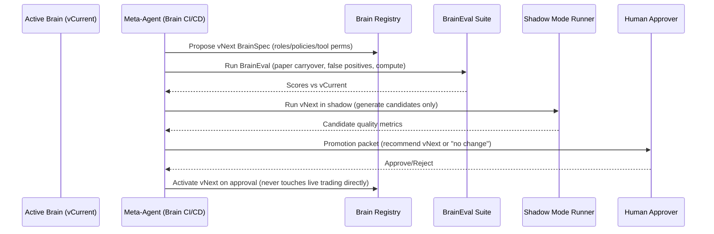

# Architecture diagram outline — Agentic Neuro-Symbolic Trading R&D System (V1)

This document is meant to be used as a **diagramming outline** (Mermaid blocks + labeled components) for your repo docs.

## 1) System context diagram (actors + boundaries)

```mermaid
flowchart LR
  subgraph Human[Human / Operator]
    A1[Approves Live Promotions]
    A2[Reviews Promotion Packets]
  end

  subgraph Exchanges[Exchanges / Brokers]
    X1[Market Data APIs]
    X2[Order APIs]
  end

  subgraph System[Trading System Boundary]
    D1[(Market Data Store)]
    D2[(Feature Store)]
    D3[(Audit Log / Event Store)]
    R1[Backtest Engine]
    P1[Paper Trading Layer]
    L1[Live Trading Layer]
    G1[Guardrails Engine<br/>(risk caps + invariants)]
    O1[LLM R&D Orchestrator]
    S1[Strategy Registry]
    B1[Brain Registry]
    M1[Monitoring + Drift Detection]
  end

  Human -->|Approval| L1
  Human -->|Reads| PP[Promotion Packet]

  Exchanges --> D1
  Exchanges --> P1
  Exchanges --> L1

  D1 --> D2
  D1 --> D3
  P1 --> D3
  L1 --> D3

  O1 --> R1
  O1 --> P1
  O1 --> PP
  O1 --> S1
  O1 --> B1

  G1 --> P1
  G1 --> L1
  G1 --> R1

  M1 --> O1
  M1 --> PP
  M1 --> G1
```

---

## 2) Component diagram (logical layers)

```mermaid
flowchart TB
  subgraph Layer0[Truth & Storage]
    E[(Event Store / Audit Log)]
    MD[(Market Data Store)]
    FS[(Feature Store)]
  end

  subgraph Layer1[Execution & Risk (hands + brakes)]
    OMS[Execution Engine (OMS/EMS)]
    RISK[Symbolic Guardrails Engine]
    BUDGET[Trade Budgeter (20 tokens/day)]
  end

  subgraph Layer2[Strategy Runtime (signals)]
    STRAT[Strategy Engine (DSL compiled)]
    REG[Regime / Predictive Models (optional)]
  end

  subgraph Layer3[Evaluation & Experimentation]
    BT[Backtest + Walk-forward Harness]
    STRESS[Stress + Sensitivity Sweeps]
    SELECT[Selection Policy (profit, then turnover, etc.)]
  end

  subgraph Layer4[Autonomous R&D (the “brain”)]
    ORCH[LLM Orchestrator (planner/critic/evaluator)]
    MUT[Mutation Operators (params + structure)]
    PACK[Promotion Packet Generator]
  end

  subgraph Layer5[Promotion & Release]
    SREG[(Strategy Registry)]
    BREG[(Brain Registry)]
    PAPER[Paper Canary → Paper Full]
    LIVE[Live (Human Approved)]
  end

  MD --> FS
  MD --> E
  OMS --> E
  STRAT --> OMS
  REG --> STRAT
  RISK --> OMS
  BUDGET --> STRAT

  ORCH --> MUT --> BT
  BT --> STRESS --> SELECT
  SELECT --> SREG
  ORCH --> PAPER
  PAPER --> E
  ORCH --> PACK
  PACK --> LIVE
  BREG --> ORCH
```

---

## 3) Strategy promotion sequence (Backtest → Paper → Human → Live)

```mermaid
sequenceDiagram
  participant ORCH as LLM Orchestrator
  participant DSL as Strategy DSL
  participant BT as Backtest Harness
  participant SEL as Selection Policy
  participant PR as Strategy Registry
  participant PAPER as Paper Trading (Canary/Full)
  participant HUMAN as Human Approver
  participant LIVE as Live Trading

  ORCH->>DSL: Generate candidate (params + structure)
  ORCH->>BT: Run walk-forward + stress + cost sensitivity
  BT-->>ORCH: Results + artifacts
  ORCH->>SEL: Rank vs champion (profit; if within 3% then turnover/complexity)
  SEL-->>ORCH: Pass/Fail + ranking
  ORCH->>PR: Register candidate + diff + reports
  ORCH->>PAPER: Auto-deploy to paper canary (guardrails enforced)
  PAPER-->>ORCH: Paper metrics (profit after costs, trades/day avg/p95/max, execution stats)
  ORCH->>PAPER: Promote to paper full OR rollback (based on paper gate)
  ORCH->>HUMAN: Produce promotion packet for live
  HUMAN-->>ORCH: Approve/Reject
  ORCH->>LIVE: Deploy approved version (optional live canary first)
```

---

## 4) Brain upgrade sequence (Brain CI/CD)



---

## 5) Diagram checklist (what to label explicitly)
When you draw the “final” diagram (draw.io / Excalidraw / Mermaid), label:
- **Risk caps + invariants** as a distinct “Root of Trust”
- **Paper-only auto-deploy** constraint
- **Human approval** as the only path into Live updates
- **Strategy DSL** as the safe modification interface
- **Selection policy** with ε=3% profit-close tie-break
- **Turnover** definition (trades/day) + budgeter (20 tokens/day)
- **Registries** (Strategy + Brain) and audit log

---

## 6) Suggested repo doc placement
- `docs/architecture_diagram_outline.md` (this file)
- `docs/agentic_neurosymbolic_trading_rd_v1_spec.md` (your V1 spec)
