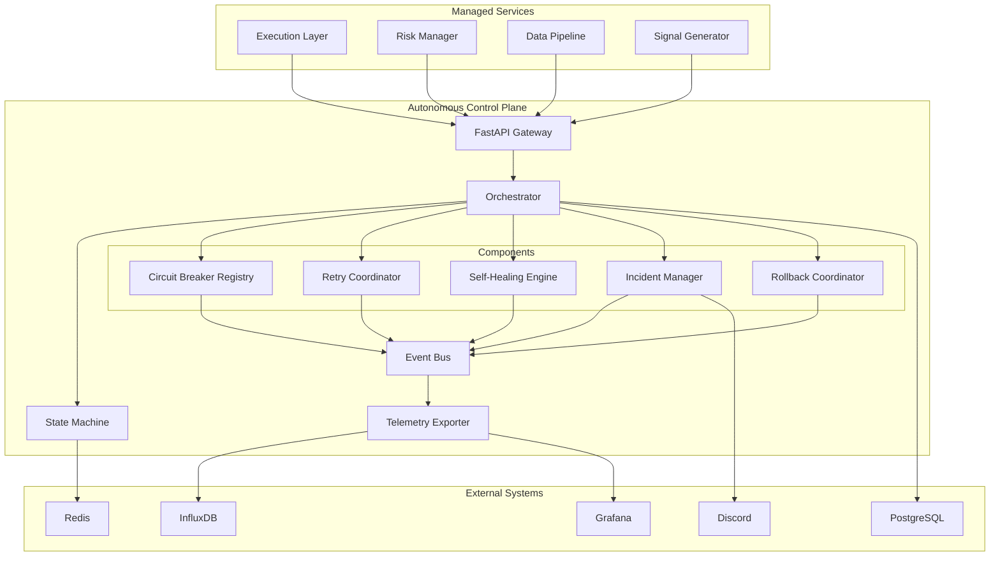

# Autonomous Control Plane - Golden Plan

## Document Information

| Field | Value |
|-------|-------|
| **Document ID** | GOLDEN-PLAN-ACP-001 |
| **Epic ID** | EP-NS-008 |
| **Created** | 2026-02-20 |
| **Status** | Approved for Implementation |
| **Author** | Party-Mode Multi-Role Synthesis |
| **Stakeholders** | Critic, Dev, SeniorDev, Merlin |

---

## Executive Summary

This document presents the reconciled "golden plan" for a **Unified Autonomous Control Plane** that consolidates fragmented autonomy capabilities into a cohesive, continuously operating, self-correcting, and observable system. The plan synthesizes perspectives from adversarial review (Critic), implementation feasibility (Dev), architectural integrity (SeniorDev), and operational readiness (Merlin).

### Key Decisions

| Decision | Rationale | Trade-offs |
|----------|-----------|------------|
| Unified Control Plane vs. Separate Services | Single source of truth for autonomy state; reduces operational complexity | Requires careful modularization to avoid coupling |
| Event-Driven Architecture | Aligns with existing Kafka/Redis patterns; enables real-time responsiveness | Adds complexity to debugging; requires structured logging |
| Gradual Rollout (3 Batches) | Risk mitigation; allows learning and adjustment | Longer time-to-full-autonomy |
| Circuit Breaker Standardization | Prevents cascading failures; consistent resilience pattern | May mask underlying issues if misconfigured |
| Human-in-the-Loop for P0 | Safety critical for financial operations | Slightly slower response to edge cases |

---

## Party-Mode Role Perspectives

### 🔍 Critic (Adversarial Analysis)

**Primary Concerns Identified:**

1. **Single Point of Failure Risk**
   - The unified control plane becomes a critical dependency
   - *Mitigation*: Implement active-passive HA pair with automatic failover

2. **Cascading Autonomy Failures**
   - Self-healing actions could trigger unexpected side effects
   - *Mitigation*: Action sandboxing, rollback capability, and blast radius limitation

3. **Observability Blind Spots**
   - Complex autonomous systems can fail silently
   - *Mitigation*: Mandatory health telemetry, heartbeat monitoring, alert on absence

4. **Testing Gap**
   - Autonomous behavior is hard to test exhaustively
   - *Mitigation*: Simulation environment, chaos engineering, gradual exposure

5. **Human Override Complexity**
   - Emergency stop must work reliably under all conditions
   - *Mitigation*: Dedicated kill-switch channel, regular drills

**Risk Register (High Priority):**

| Risk | Likelihood | Impact | Mitigation |
|------|------------|--------|------------|
| Control plane failure | Medium | Critical | HA pair, circuit breaker, graceful degradation |
| Self-healing loop | Low | High | Max iteration limits, human escalation timeout |
| Silent degradation | Medium | High | Heartbeat absence alerts, synthetic transaction monitoring |
| Configuration drift | Medium | Medium | GitOps, config validation, drift detection |
| Resource exhaustion | Low | Medium | Resource quotas, backpressure, prioritization |

---

### 💻 Dev (Implementation Perspective)

**Implementation Feasibility Assessment:**

**Existing Assets to Leverage:**

| Component | Location | Reusability |
|-----------|----------|-------------|
| Circuit Breaker | `src/common/circuit_breaker.py` | High - extend with registry |
| Kill Switch | `src/execution/kill_switch/` | High - integrate as emergency stop |
| Retry Handler | `src/execution/kill_switch/retry_handler.py` | High - consolidate |
| Self-Healing Engine | `src/automation/self_healing_engine.py` | Medium - refactor for unified control |
| Incident Logger | `scripts/incident/log_incident.py` | High - integrate into control plane |
| Merge Reconciler | `scripts/ops/merge_reconciler.py` | Medium - adopt patterns |

**Technical Stack Recommendations:**

```yaml
Control Plane Core:
  - Language: Python 3.12+
  - Framework: FastAPI (for API surface)
  - State Management: Redis (short-term) + PostgreSQL (long-term)
  - Event Bus: Redis Pub/Sub (initial), Kafka (future scale)
  - Scheduling: APScheduler + Celery (for distributed tasks)
  
Observability:
  - Metrics: InfluxDB (existing)
  - Logs: Grafana Loki (via existing Grafana)
  - Tracing: OpenTelemetry (new)
  - Alerting: Grafana On-Call (existing)
```

**Code Organization:**

```
src/autonomous_control_plane/
├── __init__.py
├── api/                    # FastAPI routes
│   ├── __init__.py
│   ├── v1/
│   │   ├── health.py
│   │   ├── incidents.py
│   │   ├── remediation.py
│   │   └── telemetry.py
├── core/                   # Core control plane logic
│   ├── __init__.py
│   ├── state_machine.py    # Autonomy state management
│   ├── orchestrator.py     # Central orchestration
│   └── governance.py       # Policy enforcement
├── components/             # Pluggable autonomy components
│   ├── __init__.py
│   ├── circuit_breaker_registry.py
│   ├── retry_orchestrator.py
│   ├── self_healing_engine.py
│   ├── incident_manager.py
│   └── rollback_coordinator.py
├── events/                 # Event handling
│   ├── __init__.py
│   ├── bus.py
│   ├── handlers.py
│   └── models.py
├── telemetry/              # Observability
│   ├── __init__.py
│   ├── metrics.py
│   ├── health_reporter.py
│   └── dashboard_sync.py
├── models/                 # Data models
│   ├── __init__.py
│   ├── autonomy_state.py
│   ├── incidents.py
│   ├── remediation.py
│   └── telemetry.py
└── config/                 # Configuration
    ├── __init__.py
    ├── settings.py
    └── policies.yaml
```

---

### 🏗️ SeniorDev (Architecture & Quality)

**Architectural Principles:**

1. **Modularity with Clear Boundaries**
   - Each autonomy component (circuit breaker, retry, self-healing) is independently deployable
   - Shared only through well-defined interfaces (events, API)
   - Prevents tight coupling that leads to cascading failures

2. **Event-Driven State Management**
   - All state changes emit events
   - Components react to events rather than direct calls
   - Enables auditability and replay capability

3. **Graceful Degradation**
   - If control plane is unavailable, components fall back to local operation
   - No hard dependency on central control for safety-critical functions
   - Kill-switch must work even without control plane

4. **Immutable History**
   - All decisions, actions, and state changes are append-only
   - Enables post-mortem analysis and compliance
   - Supports reproducibility

**Integration Points:**



**Quality Gates:**

| Gate | Criteria | Enforcement |
|------|----------|-------------|
| Code Coverage | ≥85% for control plane | CI blocking |
| Type Safety | 100% type hints | mypy strict mode |
| Documentation | All public APIs documented | CI check |
| Performance | <100ms p99 response time | Load testing |
| Resilience | Circuit breaker test for each dependency | Integration tests |

---

### 🚀 Merlin (Operations & Deployment)

**Operational Requirements:**

**Deployment Strategy:**

| Phase | Environment | Duration | Exit Criteria |
|-------|-------------|----------|---------------|
| Batch 1 | Development | 1 week | All unit tests pass, HA pair tested |
| Batch 2 | Paper Trading | 2 weeks | 99.9% uptime, <5s MTTR, zero false positives |
| Batch 3 | Live (Canary) | 2 weeks | Human approval latency <30s, rollback <60s |
| Batch 4 | Live (Full) | Ongoing | Continuous monitoring, quarterly reviews |

**Runbook Requirements:**

Every autonomous component must have:
1. **Start/Stop Procedures** - Step-by-step with verification commands
2. **Health Check Commands** - Quick diagnostic commands
3. **Common Failure Scenarios** - Symptom → Diagnosis → Remediation
4. **Escalation Paths** - When to engage humans, with contact info
5. **Rollback Procedures** - How to disable autonomy and return to manual

**Observability Requirements:**

| Metric | Target | Alert Threshold |
|--------|--------|-----------------|
| Control Plane Uptime | 99.95% | <99.9% for 5min |
| Event Processing Latency | p99 <100ms | p99 >200ms |
| Self-Healing Success Rate | >95% | <90% |
| Incident Creation → Resolution | p95 <5min | >10min |
| Kill-Switch Response Time | <1s | >2s |

**Dashboard Panels Required:**

1. **Control Plane Health**
   - Instance status (HA pair)
   - Event queue depth
   - Processing latency (p50, p95, p99)
   - Circuit breaker states

2. **Autonomy Activity**
   - Self-healing actions per hour
   - Retry attempts vs successes
   - Incident creation rate
   - Rollback frequency

3. **Decision Audit Trail**
   - Recent autonomous decisions
   - Human override frequency
   - Decision outcomes (success/failure)

---

## Reconciled Golden Architecture

### System Architecture

```
┌─────────────────────────────────────────────────────────────────────────────┐
│                         AUTONOMOUS CONTROL PLANE                             │
│  ┌─────────────────────────────────────────────────────────────────────┐   │
│  │                         API GATEWAY (FastAPI)                        │   │
│  │   /health, /state, /incidents, /remediation, /telemetry              │   │
│  └─────────────────────────────────────────────────────────────────────┘   │
│                                    │                                        │
│  ┌─────────────────────────────────────────────────────────────────────┐   │
│  │                      CENTRAL ORCHESTRATOR                            │   │
│  │  • State Machine Management                                          │   │
│  │  • Policy Enforcement                                                │   │
│  │  • Component Coordination                                            │   │
│  └─────────────────────────────────────────────────────────────────────┘   │
│                                    │                                        │
│  ┌─────────────┬─────────────┬─────────────┬─────────────┬─────────────┐   │
│  │   CIRCUIT   │    RETRY    │  SELF-      │  INCIDENT   │  ROLLBACK   │   │
│  │   BREAKER   │  COORDINA-  │  HEALING    │   MANAGER   │ COORDINATOR │   │
│  │   REGISTRY  │    TOR      │   ENGINE    │             │             │   │
│  └─────────────┴─────────────┴─────────────┴─────────────┴─────────────┘   │
│                                    │                                        │
│  ┌─────────────────────────────────────────────────────────────────────┐   │
│  │                         EVENT BUS (Redis Pub/Sub)                    │   │
│  │   • Component Events   • State Changes   • Telemetry                 │   │
│  └─────────────────────────────────────────────────────────────────────┘   │
└─────────────────────────────────────────────────────────────────────────────┘
                                    │
        ┌───────────────────────────┼───────────────────────────┐
        │                           │                           │
┌───────▼───────┐       ┌───────────▼───────────┐   ┌───────────▼───────────┐
│   TELEMETRY   │       │   STATE STORAGE       │   │   EXTERNAL EVENTS     │
│   (InfluxDB)  │       │   (Redis + PostgreSQL)│   │   (Execution, Data)   │
└───────────────┘       └───────────────────────┘   └───────────────────────┘
```

### Component Specifications

#### 1. Circuit Breaker Registry

**Purpose:** Centralized management of circuit breakers across all services

**Key Capabilities:**
- Register circuit breakers by service name
- Query circuit breaker state
- Automatic state transitions (CLOSED → OPEN → HALF_OPEN)
- Bulk operations (force open/close all)

**Interface:**
```python
class CircuitBreakerRegistry:
    def register(self, name: str, config: CircuitBreakerConfig) -> CircuitBreaker
    def get(self, name: str) -> CircuitBreaker | None
    def get_all_states(self) -> dict[str, CircuitBreakerState]
    def force_open(self, name: str) -> None
    def force_close(self, name: str) -> None
    def reset_all(self) -> None
```

#### 2. Retry Coordinator

**Purpose:** Intelligent retry orchestration with backoff strategies

**Key Capabilities:**
- Exponential backoff with jitter
- Circuit breaker integration
- Retry budget management (prevent retry storms)
- Per-operation retry policies

**Interface:**
```python
class RetryCoordinator:
    async def execute_with_retry(
        self,
        operation: Callable[[], T],
        config: RetryConfig,
        circuit_name: str | None = None
    ) -> T
    def get_retry_budget(self, service: str) -> RetryBudget
    def reset_retry_budget(self, service: str) -> None
```

#### 3. Self-Healing Engine

**Purpose:** Automated recovery from known failure scenarios

**Key Capabilities:**
- Pluggable healing actions
- Action validation and sandboxing
- Rollback of healing actions if they worsen state
- Human escalation for repeated failures

**Interface:**
```python
class SelfHealingEngine:
    def register_healer(
        self,
        failure_pattern: FailurePattern,
        healing_action: HealingAction
    ) -> None
    async def handle_failure(self, failure: FailureEvent) -> HealingResult
    def get_healing_history(self, limit: int = 100) -> list[HealingResult]
    def disable_healer(self, pattern_id: str) -> None
```

#### 4. Incident Manager

**Purpose:** Structured incident lifecycle management

**Key Capabilities:**
- Incident creation from events or manual triggers
- Severity classification (P0-P3)
- Automated remediation assignment
- Escalation on unresolved incidents
- Post-mortem generation

**Interface:**
```python
class IncidentManager:
    async def create_incident(
        self,
        title: str,
        severity: Severity,
        description: str,
        source: str
    ) -> Incident
    async def resolve_incident(
        self,
        incident_id: str,
        resolution: str
    ) -> Incident
    def get_open_incidents(self, severity: Severity | None = None) -> list[Incident]
    def escalate_incident(self, incident_id: str, reason: str) -> None
```

#### 5. Rollback Coordinator

**Purpose:** Coordinate system-wide rollbacks safely

**Key Capabilities:**
- Pre-rollback state validation
- Step-by-step rollback execution
- Rollback verification
- Post-rollback health checks
- Rollback history

**Interface:**
```python
class RollbackCoordinator:
    async def execute_rollback(
        self,
        target_state: SystemState,
        validation_checks: list[ValidationCheck]
    ) -> RollbackResult
    def can_rollback(self, target_state: SystemState) -> tuple[bool, str]
    def get_rollback_history(self) -> list[RollbackResult]
    def schedule_rollback(
        self,
        target_state: SystemState,
        trigger_condition: TriggerCondition
    ) -> ScheduledRollback
```

---

## Phased Implementation Plan

### Batch 1: Foundation (Weeks 1-2)

**Stories:**
- ST-NS-038: Circuit Breaker Registry & Telemetry
- ST-NS-039: Retry Coordinator with Budget Management

**Scope:**
- Core control plane infrastructure
- Circuit breaker consolidation
- Basic telemetry pipeline

**Success Criteria:**
- Control plane starts/stops cleanly
- All circuit breakers visible in unified dashboard
- Unit test coverage ≥85%

### Batch 2: Intelligence (Weeks 3-4)

**Stories:**
- ST-NS-040: Self-Healing Engine with Action Sandboxing
- ST-NS-041: Incident Manager with Auto-Remediation

**Scope:**
- Self-healing capabilities
- Incident lifecycle management
- Automated remediation

**Success Criteria:**
- Self-healing actions execute within 30s of failure
- All incidents tracked with proper severity
- Remediation success rate >90%

### Batch 3: Coordination (Weeks 5-6)

**Stories:**
- ST-NS-042: Rollback Coordinator with Pre-flight Validation
- ST-NS-043: Unified Dashboard & Alerting Integration

**Scope:**
- Rollback capabilities
- Dashboard integration
- End-to-end testing

**Success Criteria:**
- Rollback completes within 60s
- Dashboard shows real-time autonomy state
- Full integration tests pass

### Batch 4: Hardening (Weeks 7-8)

**Scope:**
- Chaos engineering testing
- Performance optimization
- Documentation and runbooks
- Production readiness review

---

## Dependency Map

```
ST-NS-038 (Circuit Breaker Registry)
    │
    ├── depends on: Redis, InfluxDB (existing)
    │
    ▼
ST-NS-039 (Retry Coordinator)
    │
    ├── depends on: ST-NS-038 (Circuit breaker integration)
    │
    ▼
ST-NS-040 (Self-Healing Engine)
    │
    ├── depends on: ST-NS-039 (Retry for healing actions)
    │   depends on: ST-NS-038 (Circuit breaker for healing targets)
    │
    ▼
ST-NS-041 (Incident Manager)
    │
    ├── depends on: ST-NS-040 (Create incidents from healing failures)
    │
    ▼
ST-NS-042 (Rollback Coordinator)
    │
    ├── depends on: ST-NS-041 (Create rollback incidents)
    │   depends on: ST-NS-040 (Rollback healing actions)
    │
    ▼
ST-NS-043 (Dashboard & Alerting)
    │
    └── depends on: ALL (Aggregate telemetry from all components)
```

---

## Risk Register

| ID | Risk | Likelihood | Impact | Mitigation | Owner |
|----|------|------------|--------|------------|-------|
| R1 | Control plane becomes single point of failure | Medium | Critical | HA pair, graceful degradation | SeniorDev |
| R2 | Self-healing creates infinite loops | Low | High | Max iteration limits, circuit breakers | Dev |
| R3 | Incident fatigue from false positives | Medium | Medium | Tuning, severity calibration | Merlin |
| R4 | Rollback leaves system in inconsistent state | Low | Critical | Pre-flight validation, post-flight checks | SeniorDev |
| R5 | Performance degradation under load | Medium | Medium | Load testing, resource quotas | Dev |
| R6 | Configuration drift | Medium | Medium | GitOps, config validation | Merlin |
| R7 | Integration with existing systems breaks | Medium | High | Feature flags, gradual rollout | Dev |
| R8 | Human operators lose situational awareness | Medium | Medium | Enhanced dashboards, regular training | Merlin |

---

## Operational Playbook Snippets

### Quick Health Check

```bash
# Check control plane health
curl http://localhost:8000/health

# Check circuit breaker states
curl http://localhost:8000/api/v1/circuit-breakers

# Check open incidents
curl http://localhost:8000/api/v1/incidents?status=open

# Check self-healing activity
curl http://localhost:8000/api/v1/healing?limit=10
```

### Emergency Procedures

**Disable All Autonomy (Emergency Stop):**
```bash
# Immediate stop of all autonomous actions
curl -X POST http://localhost:8000/api/v1/emergency-stop \
  -H "Authorization: Bearer $ADMIN_TOKEN" \
  -d '{"reason": "Emergency manual override", "duration_minutes": 60}'
```

**Force Circuit Breaker Open:**
```bash
curl -X POST http://localhost:8000/api/v1/circuit-breakers/{service}/force-open \
  -H "Authorization: Bearer $ADMIN_TOKEN" \
  -d '{"reason": "Manual intervention required"}'
```

**Execute Emergency Rollback:**
```bash
curl -X POST http://localhost:8000/api/v1/rollback \
  -H "Authorization: Bearer $ADMIN_TOKEN" \
  -d '{"target_state": "last_known_good", "force": true}'
```

---

## Acceptance Criteria Summary

### Epic-Level Success Criteria

1. **Continuous Operation**: System operates 24/7 without manual intervention for known failure scenarios
2. **Self-Correction**: 95%+ of known failures are automatically remediated within 5 minutes
3. **Observability**: All autonomous actions are visible in Grafana with full audit trail
4. **Safety**: Human can disable all autonomy within 5 seconds; kill-switch remains independent
5. **Reliability**: Control plane achieves 99.95% uptime with <30s automatic failover

---

## Appendix: Technology Choices

| Component | Choice | Rationale |
|-----------|--------|-----------|
| API Framework | FastAPI | Async native, auto-docs, type safety |
| State Storage | Redis + PostgreSQL | Redis for speed, PostgreSQL for durability |
| Event Bus | Redis Pub/Sub | Existing infrastructure, low latency |
| Task Queue | Celery | Distributed execution, result backends |
| Scheduling | APScheduler | Flexible job scheduling |
| Metrics | InfluxDB | Existing, time-series optimized |
| Tracing | OpenTelemetry | Vendor-neutral, broad support |

---

## Document Control

| Version | Date | Author | Changes |
|---------|------|--------|---------|
| 1.0 | 2026-02-20 | Party-Mode Synthesis | Initial golden plan |

---

*This document was created through BMAD Party-Mode multi-role synthesis incorporating perspectives from Critic, Dev, SeniorDev, and Merlin roles.*
