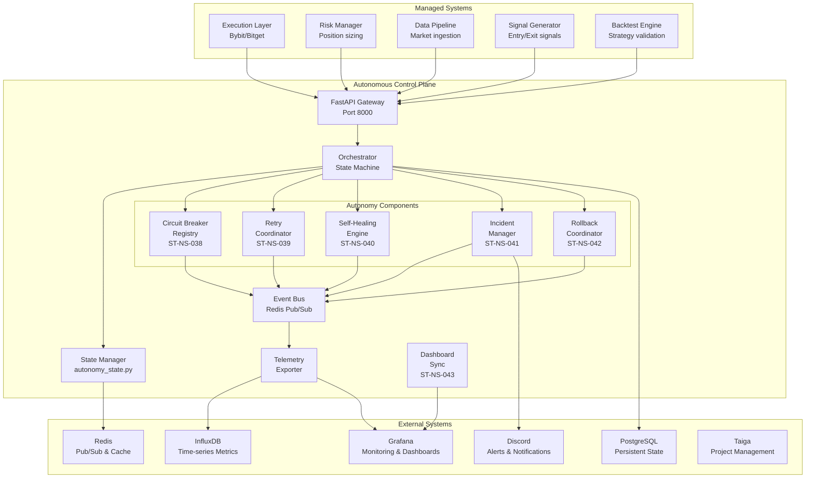

# EP-NS-008: Autonomous Control Plane - Master Planning Document

## Document Information

| Field | Value |
|-------|-------|
| **Document ID** | EP-NS-008-PLAN-001 |
| **Epic ID** | EP-NS-008 |
| **Epic Name** | Autonomous Control Plane |
| **Priority** | P0-CRITICAL |
| **Sprint** | q2-7 |
| **Story Points** | 42 |
| **Stories** | 6 |
| **Created** | 2026-02-20 |
| **Status** | Approved for Implementation |
| **Golden Plan** | docs/architecture/autonomous-control-plane-golden-plan.md |

---

## Table of Contents

1. [Executive Summary](#executive-summary)
2. [Architecture Overview](#architecture-overview)
3. [Component Specifications](#component-specifications)
4. [Story Breakdown](#story-breakdown)
5. [Dependency Graph](#dependency-graph)
6. [Integration Points](#integration-points)
7. [Risk Register](#risk-register)
8. [Implementation Roadmap](#implementation-roadmap)
9. [Operational Playbook](#operational-playbook)
10. [Appendices](#appendices)

---

## Executive Summary

### Overview

EP-NS-008 implements a **Unified Autonomous Control Plane** that consolidates fragmented autonomy capabilities into a cohesive, continuously operating, self-correcting, and observable system. This epic builds upon the completed Learning & Improvement System (EP-NS-004) to provide the operational intelligence layer that enables 24/7 autonomous trading operations.

### Strategic Context

The ChiseAI trading system has matured through:
- **Phase 1**: CI/CD automation, data pipelines, backtesting, paper trading
- **Phase 2a**: Market analysis, signal generation, portfolio risk management  
- **Phase 2b**: Learning & improvement with prediction tracking and ML feedback

**Phase 2c** (this epic) delivers the autonomous control capabilities required for production-grade reliability:
- Circuit breaker consolidation and telemetry
- Intelligent retry with budget management
- Self-healing for known failure patterns
- Structured incident management with auto-remediation
- Coordinated rollback capabilities
- Unified observability dashboard

### Success Criteria

| Criteria | Target | Measurement |
|----------|--------|-------------|
| **Continuous Operation** | 24/7 autonomous operation | Uptime monitoring via Grafana |
| **Self-Correction Rate** | ≥95% of known failures | Incident resolution telemetry |
| **Response Time** | <30s for healing actions | Prometheus-style metrics |
| **Safety** | <5s kill-switch disable | Manual trigger testing |
| **Reliability** | 99.95% control plane uptime | HA pair with automatic failover |

### Resource Summary

| Resource | Count |
|----------|-------|
| **Stories** | 6 |
| **Story Points** | 42 |
| **Duration** | 6-8 weeks (3 batches) |
| **Dependencies** | EP-NS-004 (completed) |
| **Critical Path** | ST-NS-038 → ST-NS-039 → ST-NS-040 → ST-NS-041 → ST-NS-042 |

---

## Architecture Overview

### System Architecture Diagram

```
┌─────────────────────────────────────────────────────────────────────────────┐
│                         AUTONOMOUS CONTROL PLANE                             │
│  ┌─────────────────────────────────────────────────────────────────────┐   │
│  │                         API GATEWAY (FastAPI)                        │   │
│  │   /health, /state, /incidents, /remediation, /telemetry              │   │
│  │   /circuit-breakers, /retry, /healing, /rollback                     │   │
│  └─────────────────────────────────────────────────────────────────────┘   │
│                                    │                                        │
│  ┌─────────────────────────────────────────────────────────────────────┐   │
│  │                      CENTRAL ORCHESTRATOR                            │   │
│  │  • State Machine Management (autonomy_state.py)                      │   │
│  │  • Policy Enforcement (governance.py)                                │   │
│  │  • Component Coordination (orchestrator.py)                          │   │
│  │  • Event Routing & Processing                                        │   │
│  └─────────────────────────────────────────────────────────────────────┘   │
│                                    │                                        │
│  ┌─────────────┬─────────────┬─────────────┬─────────────┬─────────────┐   │
│  │   CIRCUIT   │    RETRY    │  SELF-      │  INCIDENT   │  ROLLBACK   │   │
│  │   BREAKER   │  COORDINA-  │  HEALING    │   MANAGER   │ COORDINATOR │   │
│  │   REGISTRY  │    TOR      │   ENGINE    │             │             │   │
│  │  (7 pts)    │  (7 pts)    │  (8 pts)    │  (7 pts)    │  (7 pts)    │   │
│  └─────────────┴─────────────┴─────────────┴─────────────┴─────────────┘   │
│                                    │                                        │
│  ┌─────────────────────────────────────────────────────────────────────┐   │
│  │                         EVENT BUS (Redis Pub/Sub)                    │   │
│  │   • Component Events   • State Changes   • Telemetry                 │   │
│  └─────────────────────────────────────────────────────────────────────┘   │
└─────────────────────────────────────────────────────────────────────────────┘
                                     │
         ┌───────────────────────────┼───────────────────────────┐
         │                           │                           │
┌────────▼───────┐       ┌───────────▼───────────┐   ┌───────────▼───────────┐
│   TELEMETRY    │       │   STATE STORAGE       │   │   EXTERNAL EVENTS     │
│   (InfluxDB)   │       │   (Redis + PostgreSQL)│   │   (Execution, Data)   │
│                │       │                       │   │                       │
│  • Metrics     │       │  • Short-term state   │   │  • Signal generation  │
│  • Alerts      │       │  • Circuit states     │   │  • Order fills        │
│  • Dashboards  │       │  • Incident history   │   │  • Risk events        │
└────────────────┘       │  • Rollback log       │   │  • Market data        │
                         └───────────────────────┘   └───────────────────────┘
```

### Integration Architecture



### Data Flow Architecture

```
┌─────────────────────────────────────────────────────────────────────────────┐
│                              DATA FLOW LAYERS                                │
├─────────────────────────────────────────────────────────────────────────────┤
│                                                                             │
│  LAYER 5: OBSERVABILITY (InfluxDB → Grafana)                                │
│  ┌─────────────┐    ┌─────────────┐    ┌─────────────┐    ┌─────────────┐  │
│  │   Metrics   │───→│   Alerts    │───→│ Dashboards  │───→│   Discord   │  │
│  │  (15s freq) │    │  (rules)    │    │ (real-time) │    │ (notify)    │  │
│  └─────────────┘    └─────────────┘    └─────────────┘    └─────────────┘  │
│                                                                             │
│  LAYER 4: EVENT BUS (Redis Pub/Sub)                                         │
│  ┌─────────────┐    ┌─────────────┐    ┌─────────────┐    ┌─────────────┐  │
│  │   State     │───→│   Action    │───→│   Result    │───→│   Audit     │  │
│  │   Change    │    │   Request   │    │   Event     │    │   Log       │  │
│  └─────────────┘    └─────────────┘    └─────────────┘    └─────────────┘  │
│                                                                             │
│  LAYER 3: AUTONOMY LOGIC (In-Memory + Redis)                                │
│  ┌─────────────┐    ┌─────────────┐    ┌─────────────┐    ┌─────────────┐  │
│  │   Circuit   │◄──→│    Retry    │◄──→│   Healing   │◄──→│  Incident   │  │
│  │   State     │    │   Budget    │    │   Action    │    │   State     │  │
│  └─────────────┘    └─────────────┘    └─────────────┘    └─────────────┘  │
│                                                                             │
│  LAYER 2: STATE MANAGEMENT (PostgreSQL)                                     │
│  ┌─────────────┐    ┌─────────────┐    ┌─────────────┐    ┌─────────────┐  │
│  │   Incidents │    │   Rollback  │    │   Healing   │    │   Audit     │  │
│  │   (history) │    │   (history) │    │   (history) │    │   (history) │  │
│  └─────────────┘    └─────────────┘    └─────────────┘    └─────────────┘  │
│                                                                             │
│  LAYER 1: EXTERNAL INTEGRATION (API/WebSocket)                              │
│  ┌─────────────┐    ┌─────────────┐    ┌─────────────┐    ┌─────────────┐  │
│  │   Bybit     │    │   Bitget    │    │   Binance   │    │   Taiga     │  │
│  │   API       │    │   API       │    │   Data      │    │   API       │  │
│  └─────────────┘    └─────────────┘    └─────────────┘    └─────────────┘  │
│                                                                             │
└─────────────────────────────────────────────────────────────────────────────┘
```

### Technology Stack

| Layer | Component | Technology | Purpose |
|-------|-----------|------------|---------|
| **API** | Gateway | FastAPI (Python 3.12+) | REST API with auto-docs |
| **Events** | Bus | Redis Pub/Sub | Real-time event distribution |
| **State** | Cache | Redis | Short-term state, circuit breaker states |
| **State** | Persistence | PostgreSQL | Incident history, audit logs |
| **Metrics** | Time-series | InfluxDB | Performance metrics, telemetry |
| **Observability** | Dashboard | Grafana | Real-time monitoring |
| **Alerts** | Routing | Grafana On-Call | Escalation and paging |
| **Tasks** | Queue | Celery + Redis | Distributed task execution |
| **Tracing** | APM | OpenTelemetry | Distributed tracing |

---

## Component Specifications

### Component Summary Matrix

| Component | Story | Points | Interfaces | Dependencies | Criticality |
|-----------|-------|--------|------------|--------------|-------------|
| **Circuit Breaker Registry** | ST-NS-038 | 7 | REST API, Events | Redis, InfluxDB | Critical |
| **Retry Coordinator** | ST-NS-039 | 7 | Python SDK, Events | ST-NS-038 | Critical |
| **Self-Healing Engine** | ST-NS-040 | 8 | REST API, Events | ST-NS-039 | Critical |
| **Incident Manager** | ST-NS-041 | 8 | REST API, Events | ST-NS-040 | Critical |
| **Rollback Coordinator** | ST-NS-042 | 7 | REST API, Events | ST-NS-041 | High |
| **Dashboard Integration** | ST-NS-043 | 5 | Grafana API | All above | High |

---

## Story Breakdown

### ST-NS-038: Circuit Breaker Registry & Unified Telemetry

**Status:** Planned  
**Priority:** P0-CRITICAL  
**Story Points:** 7  
**FR Coverage:** FR-ACP-001, FR-ACP-002

#### Scope
Centralized circuit breaker management consolidating all existing circuit breakers into a unified registry with real-time telemetry.

#### Functional Requirements

| ID | Requirement | Priority |
|----|-------------|----------|
| FR-038-001 | Registry provides CRUD operations for all service circuit breakers | Must |
| FR-038-002 | Registry state persisted in Redis with PostgreSQL backup | Must |
| FR-038-003 | Telemetry exports to InfluxDB every 15s | Must |
| FR-038-004 | Dashboard panel shows all circuit breaker states | Must |
| FR-038-005 | Bulk operations complete within 1 second | Should |
| FR-038-006 | API endpoints provide queryable circuit breaker health | Must |

#### Technical Design

```python
# Core Interface
class CircuitBreakerRegistry:
    def register(
        self, 
        name: str, 
        config: CircuitBreakerConfig
    ) -> CircuitBreaker
    
    def get(self, name: str) -> CircuitBreaker | None
    def get_all_states(self) -> dict[str, CircuitBreakerState]
    def force_open(self, name: str, reason: str) -> None
    def force_close(self, name: str, reason: str) -> None
    def reset_all(self, reason: str) -> None
    
    # Telemetry
    def export_telemetry(self) -> TelemetryBatch

# State Machine
class CircuitBreakerState(Enum):
    CLOSED = "closed"      # Normal operation
    OPEN = "open"          # Failing, reject fast
    HALF_OPEN = "half_open" # Testing recovery

# Configuration
@dataclass
class CircuitBreakerConfig:
    failure_threshold: int = 5
    success_threshold: int = 3
    timeout: timedelta = timedelta(seconds=30)
    half_open_max_calls: int = 3
```

#### File Locations

```
src/autonomous_control_plane/
├── components/
│   ├── circuit_breaker_registry.py      # Main registry implementation
│   └── circuit_breaker.py               # Individual CB logic
├── models/
│   ├── circuit_breaker.py               # Pydantic models
│   └── telemetry.py                     # Telemetry data models
├── telemetry/
│   └── metrics.py                       # Metrics exporter
└── api/v1/
    └── circuit_breakers.py              # REST endpoints
```

#### Acceptance Criteria

- [ ] Circuit breaker registry provides CRUD operations for all service circuit breakers
- [ ] Registry state is persisted in Redis with PostgreSQL backup
- [ ] Telemetry exports to InfluxDB every 15s with tags for service_name, state, failure_count
- [ ] Dashboard panel shows all circuit breaker states in real-time
- [ ] Bulk operations complete within 1 second
- [ ] API endpoints provide queryable circuit breaker health
- [ ] Unit test coverage >=85% with integration tests

#### Test Strategy

| Test Type | Command | Coverage Target |
|-----------|---------|-----------------|
| Unit | `pytest tests/test_autonomous/test_circuit_breaker_registry.py -v` | 85%+ |
| Integration | `pytest tests/test_autonomous/integration/test_cb_telemetry.py -v` | - |
| E2E | `scripts/e2e/test_circuit_breaker_lifecycle.py` | - |

#### Live Validation Gates

| Gate | Check | Timeout |
|------|-------|---------|
| registry_startup | `curl -f http://localhost:8000/health` | 30s |
| telemetry_flow | `influx query from bucket chiseai for circuit_breaker_state` | 60s |

#### Rollback Plan

```bash
# 1. Disable circuit breaker automation
curl -X POST http://localhost:8000/api/v1/circuit-breakers/disable-auto

# 2. Revert to local circuit breakers
kubectl rollout undo deployment/autonomous-control-plane
```

---

### ST-NS-039: Retry Coordinator with Budget Management

**Status:** Planned  
**Priority:** P0-CRITICAL  
**Story Points:** 7  
**FR Coverage:** FR-ACP-003, FR-ACP-004  
**Depends On:** ST-NS-038

#### Scope
Intelligent retry orchestration with exponential backoff, jitter, and per-service retry budgets to prevent retry storms.

#### Functional Requirements

| ID | Requirement | Priority |
|----|-------------|----------|
| FR-039-001 | Exponential backoff with configurable base and max delay | Must |
| FR-039-002 | Jitter prevents thundering herd | Must |
| FR-039-003 | Per-service retry budgets prevent retry storms | Must |
| FR-039-004 | Integration with circuit breaker registry | Must |
| FR-039-005 | Operation-level retry policies override global defaults | Should |
| FR-039-006 | Failed operations queued for manual review | Should |

#### Technical Design

```python
# Core Interface
class RetryCoordinator:
    async def execute_with_retry(
        self,
        operation: Callable[[], T],
        config: RetryConfig,
        circuit_name: str | None = None
    ) -> T
    
    def get_retry_budget(self, service: str) -> RetryBudget
    def reset_retry_budget(self, service: str) -> None
    def get_retry_stats(self, service: str) -> RetryStats

# Configuration
@dataclass
class RetryConfig:
    max_attempts: int = 3
    base_delay: float = 1.0  # seconds
    max_delay: float = 60.0  # seconds
    exponential_base: float = 2.0
    jitter: bool = True
    jitter_max: float = 0.1  # 10% jitter
    
@dataclass
class RetryBudget:
    service: str
    max_retries_per_minute: int = 100
    current_minute_count: int = 0
    budget_exhausted: bool = False
```

#### Backoff Strategy

```python
def calculate_delay(
    attempt: int,
    base_delay: float,
    max_delay: float,
    exponential_base: float,
    jitter: bool
) -> float:
    """
    Calculate retry delay with exponential backoff and jitter.
    
    Formula: min(base_delay * (exponential_base ^ attempt), max_delay)
    With jitter: delay * (1 + random(-jitter_max, +jitter_max))
    """
    delay = min(
        base_delay * (exponential_base ** attempt),
        max_delay
    )
    
    if jitter:
        jitter_amount = random.uniform(-jitter_max, jitter_max)
        delay = delay * (1 + jitter_amount)
    
    return delay
```

#### File Locations

```
src/autonomous_control_plane/
├── components/
│   └── retry_coordinator.py             # Main coordinator
├── models/
│   └── retry_policy.py                  # Retry configuration models
└── api/v1/
    └── retry.py                         # REST endpoints
```

#### Acceptance Criteria

- [ ] Retry coordinator supports exponential backoff with configurable base and max delay
- [ ] Jitter prevents thundering herd with random component added to delays
- [ ] Per-service retry budgets prevent retry storms with >100 retries per minute blocks
- [ ] Integration with circuit breaker registry prevents retries when circuit open
- [ ] Operation-level retry policies override global defaults
- [ ] Failed operations are queued for manual review after max retries
- [ ] Retry metrics exported including attempts, successes, budget_exceeded events

#### Test Strategy

| Test Type | Command | Purpose |
|-----------|---------|---------|
| Unit | `pytest tests/test_autonomous/test_retry_coordinator.py -v` | Core logic |
| Load | `locust -f tests/load/retry_storm_prevention.py` | Storm prevention |
| Chaos | `pytest tests/chaos/test_retry_under_failure.py -v` | Resilience |

#### Rollback Plan

```bash
# Disable retry coordination
curl -X POST http://localhost:8000/api/v1/retry/disable

# Revert to component-local retry logic
git checkout HEAD~1 -- src/execution/kill_switch/retry_handler.py
```

---

### ST-NS-040: Self-Healing Engine with Action Sandboxing

**Status:** Planned  
**Priority:** P0-CRITICAL  
**Story Points:** 8  
**FR Coverage:** FR-ACP-005, FR-ACP-006  
**Depends On:** ST-NS-039

#### Scope
Automated recovery from known failure scenarios with sandboxed healing actions, rollback capability, and human escalation.

#### Functional Requirements

| ID | Requirement | Priority |
|----|-------------|----------|
| FR-040-001 | Recognize 10+ failure patterns | Must |
| FR-040-002 | Sandboxed healing action execution | Must |
| FR-040-003 | Automatic rollback of failed healing | Must |
| FR-040-004 | Max 3 healing attempts per hour per service | Must |
| FR-040-005 | Human approval for P0 or live trading impact | Must |
| FR-040-006 | Full context logging for post-mortem | Must |

#### Recognized Failure Patterns

| Pattern ID | Pattern | Healing Action | Severity |
|------------|---------|----------------|----------|
| FP-001 | Redis disconnect | Restart Redis connection pool | P2 |
| FP-002 | API timeout | Switch to backup API endpoint | P2 |
| FP-003 | Memory pressure | Clear non-critical caches | P2 |
| FP-004 | Disk space low | Rotate logs, clear temp | P2 |
| FP-005 | Database connection lost | Reconnect with backoff | P1 |
| FP-006 | Exchange rate limit | Pause requests, resume with backoff | P2 |
| FP-007 | WebSocket disconnect | Reconnect with exponential backoff | P2 |
| FP-008 | Circuit breaker open | Attempt half-open probe | P2 |
| FP-009 | High latency | Scale processing workers | P1 |
| FP-010 | Data ingestion gap | Backfill from secondary source | P1 |

#### Technical Design

```python
# Core Interface
class SelfHealingEngine:
    def register_healer(
        self,
        pattern: FailurePattern,
        action: HealingAction
    ) -> None
    
    async def handle_failure(
        self, 
        failure: FailureEvent
    ) -> HealingResult
    
    def get_healing_history(
        self, 
        limit: int = 100
    ) -> list[HealingResult]
    
    def disable_healer(self, pattern_id: str) -> None

# Sandboxed Execution
class SandboxedExecutor:
    async def execute(
        self,
        action: HealingAction,
        timeout: timedelta = timedelta(seconds=30),
        resource_limits: ResourceLimits = None
    ) -> ExecutionResult
    
    async def rollback(
        self,
        action_id: str
    ) -> RollbackResult

@dataclass
class ResourceLimits:
    max_cpu_percent: float = 50.0
    max_memory_mb: int = 512
    max_execution_time: timedelta = timedelta(seconds=30)
```

#### File Locations

```
src/autonomous_control_plane/
├── components/
│   └── self_healing_engine.py           # Main engine
├── healing_actions/
│   ├── __init__.py
│   ├── base.py                          # Base action class
│   ├── redis_reconnect.py               # Redis healing
│   ├── api_failover.py                  # API failover
│   ├── memory_cleanup.py                # Memory pressure
│   └── circuit_breaker_probe.py         # CB half-open test
├── sandbox/
│   ├── executor.py                      # Sandboxed execution
│   └── resource_monitor.py              # Resource limits
└── models/
    └── healing.py                       # Healing data models
```

#### Acceptance Criteria

- [ ] Self-healing engine recognizes 10+ failure patterns
- [ ] Healing actions execute in sandboxed environment with resource limits
- [ ] Failed healing actions are automatically rolled back within 30 seconds
- [ ] Max 3 healing attempts per hour per service to prevent flapping
- [ ] Healing actions require human approval for P0 severity or live trading impact
- [ ] Healing success and failure is logged with full context
- [ ] Healing activity dashboard shows recent actions and outcomes

#### Test Strategy

| Test Type | Command | Purpose |
|-----------|---------|---------|
| Unit | `pytest tests/test_autonomous/test_self_healing.py -v` | Core logic |
| Sandbox | `pytest tests/security/test_healing_sandbox.py -v` | Security |
| Integration | `pytest tests/test_autonomous/integration/test_healing_rollback.py -v` | Rollback |

#### Incident Handling

| Trigger | Action |
|---------|--------|
| Healing action fails 3 times in 1 hour | Create P1 incident, escalate to on-call |
| Healing rollback fails | Create P0 incident, immediate human escalation |

---

### ST-NS-041: Incident Manager with Auto-Remediation

**Status:** Planned  
**Priority:** P0-CRITICAL  
**Story Points:** 8  
**FR Coverage:** FR-ACP-007, FR-ACP-008  
**Depends On:** ST-NS-040

#### Scope
Structured incident lifecycle management with automated creation, severity classification, remediation assignment, and escalation.

#### Functional Requirements

| ID | Requirement | Priority |
|----|-------------|----------|
| FR-041-001 | Automatic incident creation from system events | Must |
| FR-041-002 | Severity classification P0-P3 | Must |
| FR-041-003 | Auto-remediation for P2/P3 with known solutions | Must |
| FR-041-004 | Immediate notification for P0/P1 | Must |
| FR-041-005 | Status transition tracking | Must |
| FR-041-006 | Post-mortem template generation | Should |

#### Severity Classification

| Severity | Criteria | Response Time | Escalation |
|----------|----------|---------------|------------|
| **P0** | Trading halted, data loss, security breach | Immediate | Page on-call + manager |
| **P1** | Degraded trading, critical feature down | <15 min | Page on-call |
| **P2** | Non-critical feature down, workarounds | <4 hours | Create ticket |
| **P3** | Minor issues, cosmetic | <24 hours | Queue for next sprint |

#### Technical Design

```python
# Core Interface
class IncidentManager:
    async def create_incident(
        self,
        title: str,
        severity: Severity,
        description: str,
        source: str,
        context: dict = None
    ) -> Incident
    
    async def resolve_incident(
        self,
        incident_id: str,
        resolution: str,
        resolved_by: str
    ) -> Incident
    
    def get_open_incidents(
        self,
        severity: Severity | None = None
    ) -> list[Incident]
    
    def escalate_incident(
        self,
        incident_id: str,
        reason: str
    ) -> None
    
    def assign_remediation(
        self,
        incident_id: str,
        remediation_action: str
    ) -> None

# Incident Model
@dataclass
class Incident:
    id: str
    title: str
    severity: Severity
    status: IncidentStatus
    description: str
    source: str
    created_at: datetime
    resolved_at: datetime | None
    resolution: str | None
    remediation_action: str | None
    context: dict
```

#### Incident Status Flow

```
┌─────────┐    ┌─────────────┐    ┌─────────────┐    ┌──────────┐
│  OPEN   │───→│ INVESTIGATING│───→│  RESOLVING  │───→│ RESOLVED │
└─────────┘    └─────────────┘    └─────────────┘    └──────────┘
      │                                           
      └──────────────────────────────────────────→│ ESCALATED
```

#### File Locations

```
src/autonomous_control_plane/
├── components/
│   └── incident_manager.py              # Main manager
├── models/
│   └── incidents.py                     # Incident data models
├── remediation/
│   ├── actions.py                       # Remediation actions
│   └── post_mortem.py                   # Post-mortem generation
└── api/v1/
    └── incidents.py                     # REST endpoints
```

#### Acceptance Criteria

- [ ] Incidents are automatically created from system events
- [ ] Severity classification P0-P3 based on impact and urgency
- [ ] Auto-remediation attempts for P2 and P3 incidents with known solutions
- [ ] P0 and P1 incidents immediately notify on-call via Discord and Grafana On-Call
- [ ] Incident status transitions tracked from open to investigating to resolved
- [ ] Post-mortem template auto-generated on incident resolution
- [ ] Incident metrics exported including creation_rate, resolution_time, escalation_rate

#### Test Strategy

| Test Type | Command | Purpose |
|-----------|---------|---------|
| Unit | `pytest tests/test_autonomous/test_incident_manager.py -v` | Core logic |
| Integration | `pytest tests/test_autonomous/integration/test_incident_lifecycle.py -v` | Lifecycle |
| E2E | `scripts/e2e/test_incident_escalation.py` | Escalation |

#### Incident Handling Rules

| Trigger | Action |
|---------|--------|
| P0 incident unresolved > 15 minutes | Escalate to engineering manager, page secondary on-call |
| Incident creation rate > 10 per hour | Create P1 incident, system-wide health investigation |

---

### ST-NS-042: Rollback Coordinator with Pre-flight Validation

**Status:** Planned  
**Priority:** P1-HIGH  
**Story Points:** 7  
**FR Coverage:** FR-ACP-009, FR-ACP-010  
**Depends On:** ST-NS-041

#### Scope
Coordinate system-wide rollbacks with pre-flight validation, step-by-step execution, and post-rollback health checks.

#### Functional Requirements

| ID | Requirement | Priority |
|----|-------------|----------|
| FR-042-001 | Pre-condition validation before rollback | Must |
| FR-042-002 | Step-by-step execution with verification | Must |
| FR-042-003 | Automatic rollback on canary gate failure | Must |
| FR-042-004 | Rollback completes within 60 seconds | Should |
| FR-042-005 | Post-rollback health checks | Must |
| FR-042-006 | Rollback history with audit trail | Must |

#### Rollback Types

| Type | Description | Use Case |
|------|-------------|----------|
| **Canary Rollback** | Revert canary deployment to previous champion | Canary gate failure |
| **Config Rollback** | Revert configuration changes | Config error detected |
| **Emergency Rollback** | Force rollback bypassing validation | Critical incident |
| **Scheduled Rollback** | Planned rollback at specific time | Maintenance window |

#### Technical Design

```python
# Core Interface
class RollbackCoordinator:
    async def execute_rollback(
        self,
        target_state: SystemState,
        validation_checks: list[ValidationCheck],
        force: bool = False
    ) -> RollbackResult
    
    def can_rollback(
        self,
        target_state: SystemState
    ) -> tuple[bool, str]
    
    def get_rollback_history(
        self,
        limit: int = 100
    ) -> list[RollbackResult]
    
    def schedule_rollback(
        self,
        target_state: SystemState,
        trigger_condition: TriggerCondition
    ) -> ScheduledRollback

# Validation Check
@dataclass
class ValidationCheck:
    name: str
    check_fn: Callable[[], tuple[bool, str]]
    is_blocking: bool = True
    timeout: timedelta = timedelta(seconds=10)

# Rollback Steps
class RollbackStep(Enum):
    VALIDATE = "validate"
    PREPARE = "prepare"
    EXECUTE = "execute"
    VERIFY = "verify"
    COMMIT = "commit"
```

#### Rollback Flow

```
┌──────────────┐
│   REQUEST    │
└──────┬───────┘
       │
       ▼
┌──────────────┐    ┌──────────┐
│  VALIDATE    │───→│  BLOCKED │
│ Pre-conditions│    └──────────┘
└──────┬───────┘
       │
       ▼
┌──────────────┐
│   PREPARE    │
│  Save state  │
└──────┬───────┘
       │
       ▼
┌──────────────┐    ┌──────────┐
│   EXECUTE    │───→│  FAILED  │
│  Step-by-step│    │  Rollback│
└──────┬───────┘    └──────────┘
       │
       ▼
┌──────────────┐    ┌──────────┐
│    VERIFY    │───→│  FAILED  │
│ Health checks│    │  Restore │
└──────┬───────┘    └──────────┘
       │
       ▼
┌──────────────┐
│    COMMIT    │
│  Finalize    │
└──────────────┘
```

#### File Locations

```
src/autonomous_control_plane/
├── components/
│   └── rollback_coordinator.py          # Main coordinator
├── models/
│   └── rollback.py                      # Rollback data models
├── validation/
│   ├── checks.py                        # Pre-flight checks
│   └── health.py                        # Post-rollback health
└── api/v1/
    └── rollback.py                      # REST endpoints
```

#### Acceptance Criteria

- [ ] Rollback coordinator validates pre-conditions before execution
- [ ] Rollback executes in steps with verification after each step
- [ ] Automatic rollback on canary gate failure
- [ ] Rollback completes within 60 seconds for standard operations
- [ ] Post-rollback health checks verify system stability
- [ ] Rollback history maintained with full audit trail
- [ ] Emergency rollback bypasses validation when force=true

#### Test Strategy

| Test Type | Command | Purpose |
|-----------|---------|---------|
| Unit | `pytest tests/test_autonomous/test_rollback_coordinator.py -v` | Core logic |
| Integration | `pytest tests/test_autonomous/integration/test_rollback_workflow.py -v` | Workflow |
| Chaos | `pytest tests/chaos/test_rollback_under_load.py -v` | Resilience |

#### Incident Handling

| Trigger | Action |
|---------|--------|
| Rollback validation fails | Create P1 incident, require manual rollback approval |
| Rollback execution fails | Create P0 incident, immediate escalation |

---

### ST-NS-043: Unified Dashboard & Alerting Integration

**Status:** Planned  
**Priority:** P1-HIGH  
**Story Points:** 5  
**FR Coverage:** FR-ACP-011, FR-ACP-012  
**Depends On:** ST-NS-038, ST-NS-039, ST-NS-040, ST-NS-041, ST-NS-042

#### Scope
Unified Grafana dashboard for autonomous control plane with real-time telemetry, alerting rules, and operational runbook integration.

#### Functional Requirements

| ID | Requirement | Priority |
|----|-------------|----------|
| FR-043-001 | Dashboard shows control plane health | Must |
| FR-043-002 | Circuit breaker states visible | Must |
| FR-043-003 | Retry activity metrics | Must |
| FR-043-004 | Healing actions visible | Must |
| FR-043-005 | Incident status panel | Must |
| FR-043-006 | Real-time updates via WebSocket | Should |
| FR-043-007 | Mobile-responsive layout | Should |

#### Dashboard Panels

| Panel | Metrics | Refresh |
|-------|---------|---------|
| **Control Plane Health** | Instance status, event queue depth, processing latency | 5s |
| **Circuit Breakers** | State per service, transition frequency | 15s |
| **Retry Activity** | Attempts, successes, budget exceeded rate | 15s |
| **Self-Healing** | Actions executed, success rate, rollback count | 15s |
| **Incidents** | Open by severity, resolution time, escalation rate | 30s |
| **Rollbacks** | Execution time, success rate, history | 30s |

#### Alerting Rules

| Alert | Condition | Severity | Channel |
|-------|-----------|----------|---------|
| ControlPlaneDown | Health check fails for 30s | P0 | Page + Discord |
| CircuitBreakerOpen | CB open > 5 minutes | P1 | Discord |
| HighRetryRate | > 50 retries/minute | P2 | Discord |
| HealingFailure | Success rate < 90% | P1 | Discord |
| IncidentSpike | > 10 incidents/hour | P1 | Page |

#### File Locations

```
infrastructure/grafana/
├── dashboards/
│   └── autonomous_control_plane.json    # Main dashboard
├── alerts/
│   └── autonomous_control_plane.yaml    # Alert rules
└── provisioning/
    └── dashboards/
        └── autonomous_control_plane.yml # Dashboard provisioning

src/autonomous_control_plane/
└── telemetry/
    └── dashboard_sync.py                # Grafana sync
```

#### Acceptance Criteria

- [ ] Dashboard shows control plane health, circuit breaker states, retry activity, healing actions, incidents
- [ ] Real-time updates refresh every 5 seconds via WebSocket
- [ ] Alerting rules for control plane down, circuit breaker open >5min, healing failure rate >10%
- [ ] Runbook links embedded in each panel for common issues
- [ ] Dashboard loads within 3 seconds
- [ ] Mobile-responsive layout for on-call access
- [ ] Dashboard JSON is version-controlled and deployable via Terraform

#### Test Strategy

| Test Type | Command | Purpose |
|-----------|---------|---------|
| Visual | `playwright test tests/visual/dashboard_autonomous_control.spec.ts` | UI |
| Integration | `pytest tests/test_autonomous/integration/test_dashboard_telemetry.py -v` | Data flow |
| E2E | `scripts/e2e/test_dashboard_load.sh` | Performance |

---

## Dependency Graph

### Story Dependencies

```
ST-NS-038 (Circuit Breaker Registry)
    │
    ├── depends on: Redis, InfluxDB (existing infrastructure)
    │
    ▼
ST-NS-039 (Retry Coordinator)
    │
    ├── depends on: ST-NS-038 (Circuit breaker integration)
    │
    ▼
ST-NS-040 (Self-Healing Engine)
    │
    ├── depends on: ST-NS-039 (Retry for healing actions)
    │   depends on: ST-NS-038 (Circuit breaker for healing targets)
    │
    ▼
ST-NS-041 (Incident Manager)
    │
    ├── depends on: ST-NS-040 (Create incidents from healing failures)
    │
    ▼
ST-NS-042 (Rollback Coordinator)
    │
    ├── depends on: ST-NS-041 (Create rollback incidents)
    │   depends on: ST-NS-040 (Rollback healing actions)
    │
    ▼
ST-NS-043 (Dashboard & Alerting)
    │
    └── depends on: ALL (Aggregate telemetry from all components)
```

### Dependency Matrix

| Story | ST-038 | ST-039 | ST-040 | ST-041 | ST-042 | ST-043 |
|-------|--------|--------|--------|--------|--------|--------|
| ST-038 | - | - | - | - | - | - |
| ST-039 | ● | - | - | - | - | - |
| ST-040 | ● | ● | - | - | - | - |
| ST-041 | ● | ● | ● | - | - | - |
| ST-042 | ● | ● | ● | ● | - | - |
| ST-043 | ● | ● | ● | ● | ● | - |

### Infrastructure Dependencies

| Component | Depends On | Status |
|-----------|------------|--------|
| Circuit Breaker Registry | Redis (chiseai-redis:6380) | ✅ Available |
| Circuit Breaker Registry | PostgreSQL (chiseai-postgres:5434) | ✅ Available |
| Circuit Breaker Registry | InfluxDB (chiseai-influxdb:18087) | ✅ Available |
| All Components | Grafana (chiseai-grafana:3001) | ✅ Available |
| All Components | Taiga (taiga-back:9002) | ✅ Available |

### External Dependencies

| Dependency | Purpose | Integration Point |
|------------|---------|-------------------|
| Bybit API | Trading execution | src/data/exchange/bybit_connector.py |
| Bitget API | Trading execution | src/data/exchange/bitget_connector.py |
| Binance API | Reference market data | src/data/exchange/binance_connector.py |
| Discord | Alert delivery | Discord webhook/API |

---

## Integration Points

### Integration with Existing Systems

#### 1. EP-NS-004: Learning & Improvement System

| Integration | Direction | Purpose |
|-------------|-----------|---------|
| Prediction Accuracy Tracker | Pull | Detect model drift, trigger healing |
| ML Feedback Loop | Pull | Get failure patterns for healing |
| Confidence Calibration | Pull | Monitor ECE degradation |

#### 2. EP-NS-003: Portfolio Risk Management

| Integration | Direction | Purpose |
|-------------|-----------|---------|
| Risk Manager | Bi-directional | Kill-switch coordination, incident creation |
| Position Sizing | Pull | Detect anomalies, trigger healing |
| Kill Switch | Bi-directional | Emergency stop integration |

#### 3. EP-OPS-001: Observability

| Integration | Direction | Purpose |
|-------------|-----------|---------|
| InfluxDB | Push | Metrics export |
| Grafana | Pull | Dashboard data |
| Alerting | Push | Alert routing |
| Taiga Sync | Push | Story status updates |

#### 4. EP-EX-001: Execution

| Integration | Direction | Purpose |
|-------------|-----------|---------|
| Bybit Connector | Bi-directional | Trading health, healing |
| Bitget Connector | Bi-directional | Trading health, healing |
| Order Manager | Pull | Order failure detection |

### API Contract Summary

#### REST Endpoints

| Endpoint | Method | Description | Story |
|----------|--------|-------------|-------|
| `/health` | GET | Control plane health | All |
| `/api/v1/circuit-breakers` | GET | List all circuit breakers | ST-038 |
| `/api/v1/circuit-breakers/{name}` | GET | Get specific circuit breaker | ST-038 |
| `/api/v1/circuit-breakers/{name}/force-open` | POST | Force open circuit breaker | ST-038 |
| `/api/v1/retry/execute` | POST | Execute with retry | ST-039 |
| `/api/v1/retry/budget/{service}` | GET | Get retry budget | ST-039 |
| `/api/v1/healing/trigger` | POST | Trigger healing action | ST-040 |
| `/api/v1/healing/history` | GET | Get healing history | ST-040 |
| `/api/v1/incidents` | GET/POST | List/create incidents | ST-041 |
| `/api/v1/incidents/{id}/resolve` | POST | Resolve incident | ST-041 |
| `/api/v1/rollback/execute` | POST | Execute rollback | ST-042 |
| `/api/v1/rollback/can-rollback` | GET | Check rollback feasibility | ST-042 |
| `/api/v1/emergency-stop` | POST | Emergency stop all autonomy | All |

#### Event Schema

```python
# Base Event
class ControlPlaneEvent(BaseModel):
    event_id: str
    event_type: str
    timestamp: datetime
    source: str
    payload: dict

# Circuit Breaker State Change
circuit_breaker_state_changed = {
    "event_type": "circuit_breaker.state_changed",
    "payload": {
        "service_name": str,
        "previous_state": str,
        "new_state": str,
        "reason": str
    }
}

# Healing Action Executed
healing_action_executed = {
    "event_type": "healing.action_executed",
    "payload": {
        "action_id": str,
        "pattern_id": str,
        "success": bool,
        "duration_ms": int
    }
}

# Incident Created
incident_created = {
    "event_type": "incident.created",
    "payload": {
        "incident_id": str,
        "severity": str,
        "title": str,
        "source": str
    }
}
```

---

## Risk Register

### Risk Summary

| Risk ID | Risk | Likelihood | Impact | Risk Level | Owner |
|---------|------|------------|--------|------------|-------|
| R1 | Control plane becomes single point of failure | Medium | Critical | **HIGH** | SeniorDev |
| R2 | Self-healing creates infinite loops | Low | High | **MEDIUM** | Dev |
| R3 | Incident fatigue from false positives | Medium | Medium | **MEDIUM** | Merlin |
| R4 | Rollback leaves system in inconsistent state | Low | Critical | **HIGH** | SeniorDev |
| R5 | Performance degradation under load | Medium | Medium | **MEDIUM** | Dev |
| R6 | Configuration drift | Medium | Medium | **MEDIUM** | Merlin |
| R7 | Integration with existing systems breaks | Medium | High | **HIGH** | Dev |
| R8 | Human operators lose situational awareness | Medium | Medium | **MEDIUM** | Merlin |

### Detailed Risk Analysis

#### R1: Control Plane Single Point of Failure

**Description:** The unified control plane becomes a critical dependency for all autonomous operations.

**Mitigation:**
1. Implement active-passive HA pair with automatic failover
2. Graceful degradation: components fall back to local operation
3. Kill-switch operates independently of control plane
4. Circuit breakers have local state cache

**Detection:**
- Health check monitoring
- Heartbeat absence alerts
- Synthetic transaction monitoring

**Response:**
- Automatic failover to standby instance
- Alert on-call team
- Engage standby if primary fails

#### R2: Self-Healing Infinite Loops

**Description:** Self-healing actions trigger the same failure repeatedly, creating an infinite loop.

**Mitigation:**
1. Max iteration limits (3 per hour per service)
2. Circuit breakers prevent re-triggering
3. Human escalation after max attempts
4. Pattern-based loop detection

**Detection:**
- Healing attempt rate monitoring
- Same-pattern detection within time window
- Success rate degradation

**Response:**
- Automatically disable healer
- Create P1 incident
- Escalate to on-call

#### R4: Rollback Inconsistent State

**Description:** Rollback execution leaves system in inconsistent state.

**Mitigation:**
1. Pre-flight validation checks
2. Step-by-step execution with verification
3. Post-rollback health checks
4. Automatic restore on failure
5. Immutable state snapshots

**Detection:**
- Post-rollback health check failures
- Metric anomalies
- Component health degradation

**Response:**
- Trigger emergency rollback restore
- Create P0 incident
- Immediate human escalation

#### R7: Integration Breakage

**Description:** Integration with existing systems breaks during rollout.

**Mitigation:**
1. Feature flags for gradual rollout
2. Comprehensive integration testing
3. Backward compatibility layer
4. Rollback capability

**Detection:**
- Integration test failures
- Health check degradation
- Error rate spikes

**Response:**
- Rollback to previous version
- Enable fallback mode
- Notify affected teams

### Risk Tracking

| Risk | Status | Last Review | Next Review |
|------|--------|-------------|-------------|
| R1 | Mitigation Planned | 2026-02-20 | 2026-03-01 |
| R2 | Mitigation Planned | 2026-02-20 | 2026-03-01 |
| R3 | Monitoring | 2026-02-20 | 2026-03-01 |
| R4 | Mitigation Planned | 2026-02-20 | 2026-03-01 |
| R5 | Monitoring | 2026-02-20 | 2026-03-01 |
| R6 | Controls Implemented | 2026-02-20 | 2026-03-01 |
| R7 | Testing Planned | 2026-02-20 | 2026-03-01 |
| R8 | Dashboard Planned | 2026-02-20 | 2026-03-01 |

---

## Implementation Roadmap

### Batch 1: Foundation (Weeks 1-2)

**Stories:** ST-NS-038, ST-NS-039  
**Story Points:** 14  
**Focus:** Core infrastructure, circuit breakers, retry logic

#### Week 1: Circuit Breaker Registry (ST-NS-038)

| Day | Activity | Deliverable |
|-----|----------|-------------|
| 1-2 | Set up project structure, models | `src/autonomous_control_plane/` skeleton |
| 3-4 | Implement circuit breaker registry | Registry with CRUD operations |
| 5 | Redis persistence, telemetry | Redis integration, InfluxDB export |

#### Week 2: Retry Coordinator (ST-NS-039)

| Day | Activity | Deliverable |
|-----|----------|-------------|
| 1-2 | Retry logic implementation | Exponential backoff, jitter |
| 3-4 | Budget management | Per-service budgets, storm prevention |
| 5 | Integration with circuit breaker | End-to-end testing |

#### Success Criteria
- Control plane starts/stops cleanly
- All circuit breakers visible in unified dashboard
- Unit test coverage ≥85%

### Batch 2: Intelligence (Weeks 3-4)

**Stories:** ST-NS-040, ST-NS-041  
**Story Points:** 16  
**Focus:** Self-healing, incident management

#### Week 3: Self-Healing Engine (ST-NS-040)

| Day | Activity | Deliverable |
|-----|----------|-------------|
| 1-2 | Failure pattern recognition | 10+ patterns defined |
| 3-4 | Sandboxed execution | Resource limits, isolation |
| 5 | Rollback capability | Automatic healing rollback |

#### Week 4: Incident Manager (ST-NS-041)

| Day | Activity | Deliverable |
|-----|----------|-------------|
| 1-2 | Incident lifecycle | Creation, classification, tracking |
| 3-4 | Auto-remediation | P2/P3 automated response |
| 5 | Escalation, post-mortem | Discord integration, templates |

#### Success Criteria
- Self-healing actions execute within 30s of failure
- All incidents tracked with proper severity
- Remediation success rate >90%

### Batch 3: Coordination (Weeks 5-6)

**Stories:** ST-NS-042, ST-NS-043  
**Story Points:** 12  
**Focus:** Rollback, dashboard, integration

#### Week 5: Rollback Coordinator (ST-NS-042)

| Day | Activity | Deliverable |
|-----|----------|-------------|
| 1-2 | Pre-flight validation | Validation check framework |
| 3-4 | Step-by-step execution | Rollback workflow |
| 5 | Health checks, history | Post-rollback verification |

#### Week 6: Dashboard Integration (ST-NS-043)

| Day | Activity | Deliverable |
|-----|----------|-------------|
| 1-2 | Grafana dashboard | Unified control plane dashboard |
| 3-4 | Alerting rules | Control plane alerts |
| 5 | End-to-end testing | Full integration validation |

#### Success Criteria
- Rollback completes within 60s
- Dashboard shows real-time autonomy state
- Full integration tests pass

### Batch 4: Hardening (Weeks 7-8)

**Focus:** Chaos engineering, performance, documentation

| Week | Activity | Deliverable |
|------|----------|-------------|
| 7 | Chaos engineering | Failure injection, resilience testing |
| 7 | Performance optimization | Load testing, optimization |
| 8 | Documentation | Runbooks, API docs, post-mortem templates |
| 8 | Production readiness review | Sign-off for live deployment |

### Timeline Summary

```
Week:  1    2    3    4    5    6    7    8
       ├────┴────┤├────┴────┤├────┴────┤├────┴────┤
Batch: │    1    ││    2    ││    3    ││    4    │
       │CB+Retry ││Healing+ ││Rollback+││Hardening│
       │         ││Incident ││Dashboard││         │
       ├────┴────┤├────┴────┤├────┴────┤├────┴────┤
       ▼         ▼▼         ▼▼         ▼▼         ▼
      Foundation  Intelligence  Coordination  Production
```

---

## Operational Playbook

### Quick Health Checks

```bash
# Check control plane health
curl http://localhost:8000/health | jq

# Check circuit breaker states
curl http://localhost:8000/api/v1/circuit-breakers | jq

# Check open incidents
curl http://localhost:8000/api/v1/incidents?status=open | jq

# Check self-healing activity
curl http://localhost:8000/api/v1/healing?limit=10 | jq

# Check retry statistics
curl http://localhost:8000/api/v1/retry/stats | jq
```

### Emergency Procedures

#### Disable All Autonomy (Emergency Stop)

```bash
# Immediate stop of all autonomous actions
curl -X POST http://localhost:8000/api/v1/emergency-stop \
  -H "Authorization: Bearer $ADMIN_TOKEN" \
  -H "Content-Type: application/json" \
  -d '{
    "reason": "Emergency manual override",
    "duration_minutes": 60,
    "requested_by": "operator-name"
  }'

# Verify emergency stop is active
curl http://localhost:8000/api/v1/status | jq '.emergency_stop_active'
```

#### Force Circuit Breaker Open

```bash
# Manually open a circuit breaker
curl -X POST http://localhost:8000/api/v1/circuit-breakers/{service}/force-open \
  -H "Authorization: Bearer $ADMIN_TOKEN" \
  -H "Content-Type: application/json" \
  -d '{
    "reason": "Manual intervention required",
    "requested_by": "operator-name"
  }'
```

#### Execute Emergency Rollback

```bash
# Emergency rollback (bypasses validation)
curl -X POST http://localhost:8000/api/v1/rollback \
  -H "Authorization: Bearer $ADMIN_TOKEN" \
  -H "Content-Type: application/json" \
  -d '{
    "target_state": "last_known_good",
    "force": true,
    "reason": "Critical system issue",
    "requested_by": "operator-name"
  }'
```

### Common Failure Scenarios

| Symptom | Diagnosis | Remediation |
|---------|-----------|-------------|
| Control plane unresponsive | Check health endpoint | Restart container, failover to standby |
| Circuit breaker stuck open | Check failure rate | Investigate root cause, reset after fix |
| High retry rate | Check retry budget metrics | Investigate dependency health |
| Healing actions failing | Check healing success rate | Disable specific healer, escalate |
| Incident spike | Check incident creation rate | System-wide health investigation |

### Escalation Paths

| Severity | Response Time | Contact | Action |
|----------|---------------|---------|--------|
| P0 | Immediate | On-call + Manager | Page both, bridge call |
| P1 | <15 min | On-call | Page on-call |
| P2 | <4 hours | Ticket | Create incident ticket |
| P3 | <24 hours | Backlog | Queue for next sprint |

### Rollback to Manual Mode

```bash
# 1. Disable all automation
curl -X POST http://localhost:8000/api/v1/emergency-stop \
  -H "Authorization: Bearer $ADMIN_TOKEN" \
  -d '{"reason": "Rolling back to manual operations"}'

# 2. Disable circuit breaker automation
curl -X POST http://localhost:8000/api/v1/circuit-breakers/disable-auto \
  -H "Authorization: Bearer $ADMIN_TOKEN"

# 3. Disable self-healing
curl -X POST http://localhost:8000/api/v1/healing/disable \
  -H "Authorization: Bearer $ADMIN_TOKEN"

# 4. Disable auto-remediation
curl -X POST http://localhost:8000/api/v1/incidents/auto-remediation/disable \
  -H "Authorization: Bearer $ADMIN_TOKEN"

# 5. Verify all disabled
curl http://localhost:8000/api/v1/status
```

---

## Appendices

### Appendix A: File Structure

```
src/autonomous_control_plane/
├── __init__.py
├── api/
│   ├── __init__.py
│   └── v1/
│       ├── __init__.py
│       ├── health.py
│       ├── circuit_breakers.py
│       ├── retry.py
│       ├── healing.py
│       ├── incidents.py
│       ├── rollback.py
│       └── telemetry.py
├── components/
│   ├── __init__.py
│   ├── circuit_breaker_registry.py
│   ├── circuit_breaker.py
│   ├── retry_coordinator.py
│   ├── self_healing_engine.py
│   ├── incident_manager.py
│   └── rollback_coordinator.py
├── core/
│   ├── __init__.py
│   ├── orchestrator.py
│   ├── state_machine.py
│   └── governance.py
├── events/
│   ├── __init__.py
│   ├── bus.py
│   ├── handlers.py
│   └── models.py
├── healing_actions/
│   ├── __init__.py
│   ├── base.py
│   ├── redis_reconnect.py
│   ├── api_failover.py
│   ├── memory_cleanup.py
│   └── circuit_breaker_probe.py
├── models/
│   ├── __init__.py
│   ├── circuit_breaker.py
│   ├── retry_policy.py
│   ├── healing.py
│   ├── incidents.py
│   ├── rollback.py
│   ├── telemetry.py
│   └── autonomy_state.py
├── sandbox/
│   ├── __init__.py
│   ├── executor.py
│   └── resource_monitor.py
├── telemetry/
│   ├── __init__.py
│   ├── metrics.py
│   ├── health_reporter.py
│   └── dashboard_sync.py
├── config/
│   ├── __init__.py
│   ├── settings.py
│   └── policies.yaml
└── tests/
    ├── __init__.py
    ├── test_circuit_breaker_registry.py
    ├── test_retry_coordinator.py
    ├── test_self_healing_engine.py
    ├── test_incident_manager.py
    ├── test_rollback_coordinator.py
    └── integration/
        ├── test_cb_telemetry.py
        ├── test_healing_rollback.py
        ├── test_incident_lifecycle.py
        └── test_rollback_workflow.py

infrastructure/grafana/
├── dashboards/
│   └── autonomous_control_plane.json
├── alerts/
│   └── autonomous_control_plane.yaml
└── provisioning/
    └── dashboards/
        └── autonomous_control_plane.yml
```

### Appendix B: Configuration Reference

```yaml
# config/policies.yaml
autonomous_control_plane:
  
  circuit_breaker:
    default_failure_threshold: 5
    default_success_threshold: 3
    default_timeout_seconds: 30
    half_open_max_calls: 3
    
  retry:
    default_max_attempts: 3
    base_delay_seconds: 1.0
    max_delay_seconds: 60.0
    exponential_base: 2.0
    jitter: true
    jitter_max_percent: 10
    
  retry_budget:
    max_retries_per_minute: 100
    services:
      bybit_api:
        max_retries_per_minute: 200
      bitget_api:
        max_retries_per_minute: 200
      
  self_healing:
    max_attempts_per_hour: 3
    sandbox:
      max_cpu_percent: 50
      max_memory_mb: 512
      max_execution_seconds: 30
    require_approval_for:
      - P0
      - live_trading_impact
      
  incident:
    auto_remediation:
      enabled: true
      max_severity: P2
    escalation_timeouts:
      P0: 0  # Immediate
      P1: 900  # 15 minutes
      P2: 14400  # 4 hours
      P3: 86400  # 24 hours
      
  rollback:
    max_execution_seconds: 60
    pre_flight_checks:
      - no_active_trades
      - data_consistency
      - service_health
    post_rollback_checks:
      - service_health
      - metric_stability
      - transaction_integrity
```

### Appendix C: Metric Reference

| Metric | Type | Tags | Description |
|--------|------|------|-------------|
| `circuit_breaker_state_changes` | counter | service, state | CB state transitions |
| `circuit_breaker_failure_count` | gauge | service | Current failure count |
| `registry_query_latency_p99` | histogram | - | Registry query latency |
| `retry_attempts_total` | counter | service, result | Retry attempt count |
| `retry_budget_exceeded_rate` | gauge | service | Budget exceeded percentage |
| `healing_actions_executed` | counter | pattern, result | Healing action count |
| `healing_success_rate` | gauge | pattern | Healing success percentage |
| `healing_execution_time` | histogram | pattern | Healing execution duration |
| `incidents_open_by_severity` | gauge | severity | Open incident count |
| `incident_creation_rate` | counter | severity | Incident creation rate |
| `incident_resolution_time_p95` | histogram | severity | Time to resolve |
| `incident_escalation_rate` | gauge | severity | Escalation percentage |
| `rollback_execution_time` | histogram | - | Rollback duration |
| `rollback_success_rate` | gauge | - | Rollback success percentage |
| `control_plane_health` | gauge | instance | Control plane health status |
| `event_queue_depth` | gauge | - | Event queue size |
| `event_processing_latency_p99` | histogram | - | Event processing latency |

### Appendix D: Acceptance Criteria Summary

| Story | AC Count | Key Criteria |
|-------|----------|--------------|
| ST-NS-038 | 7 | Registry CRUD, persistence, telemetry, dashboard |
| ST-NS-039 | 7 | Backoff, jitter, budgets, circuit breaker integration |
| ST-NS-040 | 7 | 10+ patterns, sandboxing, rollback, rate limiting |
| ST-NS-041 | 7 | Auto-creation, severity, auto-remediation, escalation |
| ST-NS-042 | 7 | Pre-flight validation, step execution, health checks |
| ST-NS-043 | 7 | Dashboard panels, alerting, runbook integration |

### Document Control

| Version | Date | Author | Changes |
|---------|------|--------|---------|
| 1.0 | 2026-02-20 | Sisyphus-Junior | Initial comprehensive planning document |

---

*This document provides the authoritative planning reference for EP-NS-008 implementation. All story implementations must align with this document. For questions or changes, escalate to Jarvis with context.*
